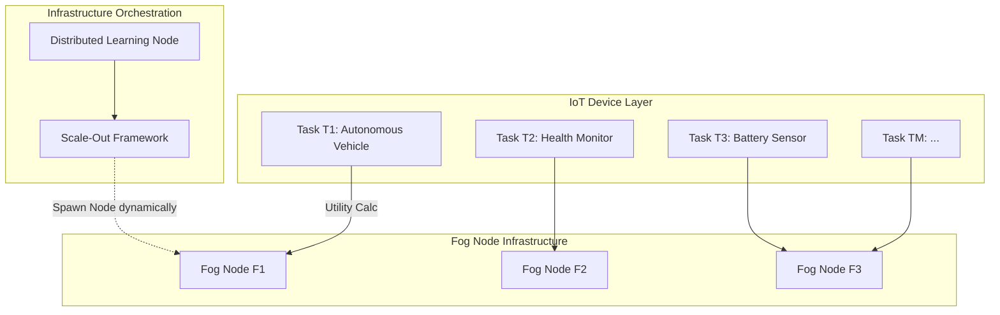

# AC-DL-MATCH System Architecture

> **Technical architecture, algorithms, and implementation details for research project**

---

## 🏗️ System Architecture Overview

AC-DL-MATCH implements a **distributed three-layer architecture** for fog computing task offloading with dynamic infrastructure elasticity.



---

## 📐 Mathematical Formulations

### 1. System Model

#### Task Nodes (T)

```
T = {T₁, T₂, ..., Tₘ}

Each task Tᵢ is characterized by:
Tᵢ = (Sᵢ, χᵢ, τᵢ)

Where:
- Sᵢ ∈ ℝ⁺ : Task data size (MB)
- χᵢ ∈ ℝ⁺ : Computational complexity (CPU cycles)
- τᵢ ∈ {delay-sensitive, energy-critical, mission-critical} : Task type
```

**Task Type Classification**:
```python
τᵢ = {
    'delay-sensitive':   # Autonomous vehicles, AR/VR, real-time gaming
    'energy-critical':   # Battery-powered sensors, wearables
    'mission-critical':  # Healthcare monitors, industrial safety systems
}
```

---

#### Fog Nodes (F)

```
F = {F₁, F₂, ..., Fₙ}

Each fog node Fⱼ is characterized by:
Fⱼ = (fⱼ, memⱼ, Qⱼ, Cⱼ, Rⱼ)

Where:
- fⱼ ∈ ℝ⁺ : CPU frequency (GHz)
- memⱼ ∈ ℝ⁺ : Memory capacity (GB)
- Qⱼ ∈ ℕ : Maximum queue capacity (# concurrent tasks)
- Cⱼ ∈ ℝ⁺ : Cost per bit ($/MB)
- Rⱼ ∈ [0, 1] : Reliability score
```

**Reliability Score Calculation**:
```
Rⱼ⁽ᵗ⁾ = Uptime_j / TotalTime

Where:
- Uptime_j = Cumulative operational time (no failures)
- TotalTime = Total observation period

Historical Uptime Tracking:
R_j^(t+1) = β × R_j^(t) + (1 - β) × I_j^(t)

Where:
- β ∈ [0.9, 0.95] : Smoothing factor
- I_j^(t) ∈ {0, 1} : Indicator (1 if operational, 0 if failed at time t)
```

---

#### SDN Controllers (S)

```
S = {S₁, S₂, ..., Sₖ}

Each SDN controller Sₖ manages a domain:
Sₖ = {Fₖ, Gₖ(Vₖ, Eₖ)}

Where:
- Fₖ ⊂ F : Set of fog nodes in domain k
- Gₖ = (Vₖ, Eₖ) : Network topology graph
  - Vₖ : Vertices (fog nodes)
  - Eₖ : Edges (network connections)
```

**Network Edges**:
```
Each edge eᵢⱼ ∈ E is characterized by:
eᵢⱼ = (δᵢⱼ, pdᵢⱼ, hᵢⱼ)

Where:
- δᵢⱼ ∈ ℝ⁺ : Data rate (Mbps)
- pdᵢⱼ ∈ ℝ⁺ : Propagation delay (ms)
- hᵢⱼ ∈ ℕ : Hop count between nodes i and j
```

---

### 2. Context-Aware Utility Function

#### Standard Utility (Before Modification)

```
U_ij^original = 1 / D_ij - C_ij
```

**Problem**: Ignores energy and reliability, treats all tasks equally, and suffers from **Dimensional Collapse** where milliseconds and monetary values skew scalar boundaries heavily depending on arbitrary physical limits.

---

#### Modified Normalized Utility (AC-DL-MATCH)

We implement an $O(1)$ Decentralized SLA-Bounding Protocol wherein Edge nodes normalize all newly discovered resources exclusively into an $\in [0, 1]$ dimension space safely natively:

```
U_ij^modified = (ω₁^Tᵢ × D_norm) + (ω₂^Tᵢ × E_norm) + (ω₃^Tᵢ × R_norm) + (ω₄^Tᵢ × C_norm)
```

**Component Bounding Breakdown**:
Rather than absolute values, each metric $x$ evaluates strictly bounding against SLA maximum thresholds mapping: 
$X_{norm} = \max(0, 1 - \frac{x}{X_{max}})$

**Component Breakdown**:

##### Delay Component (D_ij)
```
D_ij^(t) = pd_ij + trans_ij + exec_ij

Where:
- pd_ij = Propagation delay (network latency)
- trans_ij = Transmission delay = S_i / δ_ij
- exec_ij = Execution delay = χ_i / f_j
```

##### Energy Component (E_ij)
```
E_ij^(t) = P_tran × (S_i / δ_ij) + P_idle × Q_j^(t)

Where:
- P_tran : Transmission power (Watts)
- P_idle : Idle power consumption of fog node
- Q_j^(t) : Current queue occupancy (# tasks waiting)
```

**Rationale**: Energy = Transmission energy + Waiting energy (fog node idle power while task in queue)

##### Reliability Component (R_j)
```
R_j^(t) = Uptime_j / TotalTime

Already defined above
```

##### Cost Component (C_ij)
```
C_ij^(t) = C_j × S_i^(τ)

Where:
- C_j : Cost per MB at fog node j
- S_i^(τ) : Task size (possibly adjusted by priority)
```

---

#### Task-Specific Weight Assignment (ω^Tᵢ)

```
ω^Tᵢ = {ω₁^Tᵢ, ω₂^Tᵢ, ω₃^Tᵢ, ω₄^Tᵢ}

Weight Assignment Table:

┌──────────────────────┬─────────┬─────────┬─────────┬─────────┐
│ Task Type (τᵢ)       │ ω₁ (D)  │ ω₂ (E)  │ ω₃ (R)  │ ω₄ (C)  │
├──────────────────────┼─────────┼─────────┼─────────┼─────────┤
│ Delay-Sensitive      │  0.6    │  0.1    │  0.2    │  0.1    │
│ Energy-Critical      │  0.2    │  0.5    │  0.2    │  0.1    │
│ Mission-Critical     │  0.3    │  0.1    │  0.5    │  0.1    │
└──────────────────────┴─────────┴─────────┴─────────┴─────────┘

Constraint: Σ ωᵢ = 1.0 (normalized weights)
```

**Note on Scale & Context Injecting:**
Because applications (Video caching vs Emergency Braking) dynamically swap inside the IoT cluster, the tasks change dynamically. Our Deep Learning Algorithm (DRL) specifically ingests `(4 × max_sdn_fogs) + 4` variables where the exact 4 $\omega$ weights of the active Edge Node are inherently concatenated to the tensor so the learning agent fully models identical internal contexts! 

Additionally, network testing scales utilize stochastic bursts using **Poisson Probabilistic Generators** ($\lambda=0.8$) rather than legacy `CBR (Constant Bit Rate)` metrics, accurately emulating volatile real-world smart-city alarms safely natively!

---

### 3. Temporal Decay-Weighted Acceptance Probability

#### Standard Acceptance Probability (Before)

```
π_ij^(t) = σ(θᵀ × x_ij^(t))

Where:
- σ(z) = 1 / (1 + e^(-z)) : Sigmoid function
- θ ∈ ℝⁿ : Learned weights (fixed)
- x_ij = [U_ij, q_j, π_ij^history] : Feature vector
```

**Problem**: Historical π_ij^history weighted equally regardless of how old the data is.

---

#### Temporal Decay Modification (AC-DL-MATCH)

```
π_ij^(t) = σ(α × U_ij^(t) + β × π_ij^history × e^(-λ × Δt_ij) + γ × (q_ij^avail / q_ij^total))
```

**Parameter Definitions**:

```
α, β, γ ∈ ℝ⁺ : Learned constants
  Typical values:
  - α = 0.5 (utility weight)
  - β = 0.3 (history weight)
  - γ = 0.2 (availability weight)
  
  Constraint: α + β + γ = 1.0

λ ∈ ℝ⁺ : Decay rate (typically 0.1)
  Controls how fast old data becomes irrelevant

Δt_ij = t_current - t_last_interaction
  Time elapsed since task type i last used fog node j

e^(-λ × Δt_ij) : Exponential decay factor
  - If Δt_ij = 0 (just interacted): e^0 = 1.0 (full weight)
  - If Δt_ij = 10: e^(-0.1×10) = 0.368 (decay to 37%)
  - If Δt_ij = 50: e^(-0.1×50) = 0.007 (nearly zero)

q_ij^avail / q_ij^total : Queue availability ratio
  - q_ij^avail = Q_j - current_occupancy
  - q_ij^total = Q_j (max capacity)
```

**Example Calculation**:

**Scenario**: Task T1 last interacted with Fog Node F1 10 time units ago. Historical success rate = 0.85.

```
U_ij = 1.974 (from previous calculation)
π_ij^history = 0.85
Δt_ij = 10
q_ij^avail = 40 (out of 50 total)

π_ij = σ(0.5 × 1.974 + 0.3 × 0.85 × e^(-0.1×10) + 0.2 × (40/50))
     = σ(0.987 + 0.3 × 0.85 × 0.368 + 0.2 × 0.8)
     = σ(0.987 + 0.094 + 0.16)
     = σ(1.241)
     = 1 / (1 + e^(-1.241))
     = 0.776 (77.6% acceptance probability)
```

---

### 4. Cross-Domain Federation Utility (AC-DL-MATCH)

#### Distributed SDN-Domain Migration Penalty

Instead of computationally intensive k-hop searches across edges, the intelligent `SDN Controller` inherently isolates traffic to local domains. If `Utility` or `Acceptance Probabilities` fail locally, Tasks migrate East-West to an adjacent SDN Controller.

```
U_ij^cross-domain = {
    U_ij^init                           if F_j ∈ Domain_local
    U_ij^init × (1.0 - PENALTY_CROSS)   if F_j ∈ Domain_neighbor
}

Where:
- U_ij^init : Initial normalized utility
- PENALTY_CROSS : 0.20 (20% routing utility drop standard for East-West WAN interconnect latency overhead)
```

**Rationale**: Provide federated elasticity without suffocating IoT execution cycles:
1. IoT nodes are completely bypassed regarding topological graph complexity (Zero-Overhead).
2. Local traffic stays within the immediate SDN broadcast domain.
3. Adjacent SDN load-balancing inherently simulates WAN latency mathematically without fabricating nested hop counts.

**Example**:

```
U_ij^init = 0.85
PENALTY_CROSS = 0.20

Case 1: F_j is in the local SDN Domain
U_ij^cross-domain = 0.85 

Case 2: F_j is migrated across to Neighbor SDN Domain
U_ij^cross-domain = 0.85 × (1 - 0.20) 
                  = 0.68
```

---

### 5. Dynamic Infrastructure Elasticity

#### Scale-Out Policy (Add Fog Nodes)

**Trigger Condition**:
```
IF (ρ_reject^(t) > θ_reject):
    Add new fog node F_new
```

**Metric Definitions**:

```
ρ_reject^(t) = (# Rejected Tasks in window W) / (# Total Task Arrivals in window W)

Calculation over sliding window:
ρ_reject = (Σ_{i=t-W}^{t} Rejected_i) / (Σ_{i=t-W}^{t} Arrivals_i)

Where:
- W : Sliding window size (e.g., last 10 time slots)
- Rejected_i : Number of rejected tasks at time i
- Arrivals_i : Number of task arrivals at time i
```

**Interpretation**:
- High `ρ_reject` → Many tasks failing locally
- **Action**: Need more local capacity → Add fog node

**Typical Thresholds**:
```
θ_reject = 0.15 to 0.20 (15-20% rejection rate)
```

---

#### Scale-In Policy (Remove Fog Nodes)

**Trigger Condition**:
```
IF (μ_j^(t) < θ_util) for duration > θ_time:
    Remove fog node F_j
```

**Average Utilization Calculation**:
```
μ_j^(t) = (1 / W) × Σ_{τ=t-W}^{t} (# Active Tasks on F_j at τ) / Q_j

Where:
- W : Sliding window (e.g., 10 time slots)
- Q_j : Maximum queue capacity of fog node j
```

**Example**:
```
Fog Node F_j: Q_j = 100 (max capacity)

Time slot observations (last 10 slots):
[5, 8, 3, 7, 10, 6, 4, 9, 5, 3] tasks active

μ_j = (1/10) × Σ(5+8+3+7+10+6+4+9+5+3) / 50
    = (1/10) × (60 / 50)
    = 0.12 (12% average utilization)

If θ_util = 0.25 (25% threshold):
    μ_j < θ_util → Fog node underutilized
    
If sustained for θ_time = 10 slots:
    Remove F_j to save energy
```

**Typical Thresholds**:
```
θ_util = 0.20 to 0.30 (20-30% utilization threshold)
θ_time = 5 to 10 time slots (sustained low usage)
```

---

### 5. Multi-SDN Routing (Tiered Federation Architecture)

**Decision Logic Blueprint**:

```
Tier 1: Intradomain Match
Local_Best = argmax(U_ij × p_ij), ∀ F_j ∈ Domain_local
Execute Local Match if Local_Best exists

Tier 2: Interdomain (East-West) Match
Neighbor_Best = argmax(U_ij × (1 - PENALTY_CROSS) × p_ij), ∀ F_j ∈ Domain_neighbor
Execute Cross-Domain Migration Match if Local_Best failed (Queue Full)
    
Tier 3: Cloud Escalation
IF Both Local and Neighbor completely exhaust all viable permutations (K=3 Retries):
    Escalate to Cloud Datacenter (Apply massive physical penalties)
```

**The East-West Scaling Paradox**:
During development, we discovered that implementing strict `MIN_UTILITY_THRESHOLD` floors on cross-domain traffic mathematically forces a "Synchronization Trap." If multiple edge nodes concurrently target the best local fog, the fog's queue instantly saturates (Thundering Herd). To survive, traffic must spill over to adjacent SDNs. However, because adjacent fogs carry a physical `PENALTY_CROSS`, an artificial utility threshold will rigidly reject these "degraded" neighbor fogs and instead escalate to the Cloud (which has effectively 0.0 utility). 
To prevent this, AC-DL-MATCH evaluates traffic dynamically: **always take the absolute best organic matching score, and only fallback to the Cloud when physically out of localized bounds.**

**Rationale**: Provide strict fallback networks before eating the massive Cloud Round-Trip times.

## 🔄 Algorithm Phases

### Phase 1: SDN Federation Initialization

```python
def initialize_federated_system():
    env_config = {"NUM_SDNS": 3, "NUM_FOGS": 30, "NUM_EDGES": 3000} # 1:10:1000 Ratio
    
    # 1. Initialize SDNs 
    sdns = [SDNController(i) for i in range(env_config["NUM_SDNS"])]
    
    # 2. Link SDNs into a Ring Routing Topology
    for i in range(len(sdns)):
        sdns[i].neighbor_sdns.append(sdns[(i+1) % len(sdns)])
        sdns[i].neighbor_sdns.append(sdns[(i-1) % len(sdns)])
        
    # 3. Provision Fogs to local Domains
    for i in range(env_config["NUM_FOGS"]):
        target_sdn = i % len(sdns)
        sdns[target_sdn].local_fogs.append(FogNode(i))
```

---

### Phase 2: Orchestration & Distributed Matching Execution

```python
def execute_matching_epoch(sdns, edges, t):
    for sdn in sdns:
        # Build global topology cache
        local_fogs = sdn.local_fogs
        neighbor_fogs = [f for n in sdn.neighbor_sdns for f in n.local_fogs]
        
        for task in sdn.local_edges:
            # Universal Tiered Evaluation
            best_fog, best_utility, best_probability = run_policy(
                "AC_DL_MATCH", sdn, task, local_fogs, neighbor_fogs, t
            )
            
            if not best_fog:
                cloud_escalation()
                continue
                
            outcome = best_fog.simulate_outcome()
            
            # The SDN Learns Federatively from its Domain's physical feedback
            features = [best_utility, best_fog.resources_left]
            sdn.domain_db.append((features, outcome))

        # Train Stochastic Regression asynchronously per Domain
        if t % 5 == 0:
            sdn.learn_from_domain()
```

---

### Phase 5: Scale-Out Decision (Infrastructure Elasticity)

```python
def check_scale_out_trigger(scale_out_manager, metrics_window):
    """
    Check if scale-out conditions are met.
    
    Args:
        scale_out_manager: ScaleOutManager instance
        metrics_window: Recent metrics (last W time slots)
    
    Returns:
        should_scale_out: Boolean
    """
    # 1. Calculate rejection rate over window
    total_arrivals = sum(m['arrivals'] for m in metrics_window)
    total_rejections = sum(m['rejections'] for m in metrics_window)
    rejection_rate = total_rejections / total_arrivals if total_arrivals > 0 else 0
    
    # 2. Calculate cross-domain success rate
    total_cross_domain = sum(m['cross_domain_success'] for m in metrics_window)
    cross_domain_rate = total_cross_domain / total_rejections if total_rejections > 0 else 0
    
    # 3. Check trigger conditions
    if (rejection_rate > scale_out_manager.rejection_threshold and 
        cross_domain_rate < scale_out_manager.cross_domain_threshold):
        return True
    
    return False

def execute_scale_out(domain_sdn, new_fog_node_config):
    """
    Add a new fog node to the domain.
    
    Args:
        domain_sdn: SDN controller for the domain
        new_fog_node_config: Configuration for new fog node
    """
    # 1. Provision new fog node
    new_fog_node = FogNode(
        id=new_fog_node_config['id'],
        cpu_freq=new_fog_node_config['cpu_freq'],
        memory=new_fog_node_config['memory'],
        queue_capacity=new_fog_node_config['queue_capacity'],
        cost_per_mb=new_fog_node_config['cost_per_mb'],
        reliability=0.95  # Initial reliability estimate
    )
    
    # 2. Add to SDN controller's fog node list
    domain_sdn.fog_nodes.append(new_fog_node)
    
    # 3. Update network topology (connect to nearby nodes)
    domain_sdn.update_topology_with_new_node(new_fog_node)
    
    # 4. Log event
    log_scale_out_event(new_fog_node, domain_sdn)
```

---

### Phase 6: Scale-In Decision (Remove Underutilized Nodes)

```python
def check_scale_in_candidates(scale_in_manager, fog_nodes, metrics_history):
    """
    Identify fog nodes eligible for removal (sustained low utilization).
    
    Args:
        scale_in_manager: ScaleInManager instance
        fog_nodes: List of all fog nodes
        metrics_history: Historical utilization data
    
    Returns:
        candidates: List of fog nodes to remove
    """
    candidates = []
    
    for fog_node in fog_nodes:
        # 1. Calculate average utilization over window
        utilization_history = metrics_history[fog_node.id][-scale_in_manager.time_threshold:]
        avg_utilization = sum(utilization_history) / len(utilization_history)
        
        # 2. Check if below threshold for sustained period
        if avg_utilization < scale_in_manager.utilization_threshold:
            if len(utilization_history) >= scale_in_manager.time_threshold:
                # Sustained low utilization
                candidates.append(fog_node)
    
    return candidates

def execute_scale_in(domain_sdn, fog_node_to_remove):
    """
    Remove an underutilized fog node.
    
    Args:
        domain_sdn: SDN controller for the domain
        fog_node_to_remove: Fog node to remove
    """
    # 1. Migrate active tasks to other nodes (if any)
    if fog_node_to_remove.current_queue > 0:
        migrate_active_tasks(fog_node_to_remove, domain_sdn.fog_nodes)
    
    # 2. Remove from SDN controller's fog node list
    domain_sdn.fog_nodes.remove(fog_node_to_remove)
    
    # 3. Update network topology (remove connections)
    domain_sdn.update_topology_remove_node(fog_node_to_remove)
    
    # 4. Log event
    log_scale_in_event(fog_node_to_remove, domain_sdn)
```

---

## 📊 Simulation Architecture

### Simulation Framework Details

**Python Benchmark Simulator**: A strictly pure-Python environment, architected with Numpy and PyTorch, bypassing the bloated nature of Java-based tools like iFogSim for ultra-fast, highly concurrent DRL learning.

#### Core Python Engine Simulation Loop

```python
# 1. AC_DL_MATCH_TaskOffloading
class AC_DL_MATCH_TaskOffloading:
    def select_fog_node(self, task, local_fogs, neighbor_fogs, sdn_controller):
        # 1. Evaluate Local Domain
        local_best = self.rank_by_utility(task, local_fogs)
        
        # 2. Evaluate Neighbor Domain (with penalty)
        neighbor_best = self.rank_by_utility(task, neighbor_fogs, apply_penalty=True)
        
        # 3. Probabilistic Verification
        for node in [local_best, neighbor_best]:
            prob = sdn_controller.get_acceptance_probability(node)
            if math.random() < prob and node.has_capacity():
                return node  # Successfully Matched
        
        return None  # Escalate to Cloud
```

---

### Python Algorithm Implementation

**For detailed utility calculations and ML components**:

```python
# algorithms/context_aware_utility.py

import numpy as np
from typing import Dict, Tuple

class ContextAwareUtilityCalculator:
    """
    Calculate context-aware multi-objective utility for task-fog node pairs.
    """
    
    # Task-type specific weight configurations
    WEIGHT_CONFIGS = {
        'delay-sensitive': {'w1': 0.6, 'w2': 0.1, 'w3': 0.2, 'w4': 0.1},
        'energy-critical': {'w1': 0.2, 'w2': 0.5, 'w3': 0.2, 'w4': 0.1},
        'mission-critical': {'w1': 0.3, 'w2': 0.1, 'w3': 0.5, 'w4': 0.1},
    }
    
    def __init__(self, 
                 transmission_power: float = 2.0,  # Watts
                 idle_power: float = 0.5):         # Watts
        self.P_tran = transmission_power
        self.P_idle = idle_power
    
    def calculate_delay(self, 
                       task_size: float,        # MB
                       complexity: float,       # CPU cycles
                       data_rate: float,        # Mbps
                       propagation_delay: float,# ms
                       fog_cpu_freq: float):    # GHz
        """Calculate total delay: propagation + transmission + execution."""
        
        # Propagation delay (ms)
        pd = propagation_delay
        
        # Transmission delay (ms)
        trans = (task_size * 8) / (data_rate * 1000)  # Convert MB to bits, Mbps to bps
        
        # Execution delay (ms)
        exec_delay = (complexity / (fog_cpu_freq * 1e9)) * 1000  # Convert to ms
        
        total_delay = pd + trans + exec_delay
        return total_delay
    
    def calculate_energy(self, 
                        task_size: float,
                        data_rate: float,
                        queue_occupancy: int):
        """Calculate energy consumption: transmission + idle waiting."""
        
        # Transmission energy (Wh)
        trans_energy = self.P_tran * (task_size / data_rate)
        
        # Idle waiting energy (Wh) - proportional to queue length
        idle_energy = self.P_idle * queue_occupancy
        
        total_energy = trans_energy + idle_energy
        return total_energy
    
    def calculate_utility(self, 
                         task: Dict,
                         fog_node: Dict,
                         network_params: Dict) -> float:
        """
        Calculate modified context-aware utility.
        
        Args:
            task: {'size': float, 'complexity': float, 'type': str}
            fog_node: {'cpu_freq': float, 'queue': int, 'reliability': float, 'cost': float}
            network_params: {'data_rate': float, 'prop_delay': float, 'hop_count': int}
        
        Returns:
            utility: float (higher is better)
        """
        # Get task-specific weights
        weights = self.WEIGHT_CONFIGS[task['type']]
        
        # Calculate delay component
        delay = self.calculate_delay(
            task['size'], 
            task['complexity'],
            network_params['data_rate'],
            network_params['prop_delay'],
            fog_node['cpu_freq']
        )
        
        # Calculate energy component
        energy = self.calculate_energy(
            task['size'],
            network_params['data_rate'],
            fog_node['queue']
        )
        
        # Reliability component
        reliability = fog_node['reliability']
        
        # Cost component
        cost = fog_node['cost'] * task['size']
        
        # Combined utility
        utility = (
            weights['w1'] * (1 / delay) +
            weights['w2'] * (1 / energy) +
            weights['w3'] * reliability -
            weights['w4'] * cost
        )
        
        return utility
```

---

## 🔧 Implementation Roadmap

### Phase 1: Core Algorithm (Weeks 1-4)
- [ ] Implement context-aware utility calculation
- [ ] Implement temporal decay acceptance probability
- [ ] Implement k-hop locality filtering
- [ ] Unit tests for all components

### Phase 2: Infrastructure Elasticity (Weeks 5-6)
- [ ] Implement scale-out policy
- [ ] Implement scale-in policy
- [ ] Metrics collection and monitoring

### Phase 3: Multi-Domain Support (Weeks 7-8)
- [ ] Implement cross-domain routing
- [ ] SDN controller coordination
- [ ] Domain handoff protocols

### Phase 4: iFogSim Integration (Weeks 9-10)
- [ ] Java wrapper for Python algorithms
- [ ] Custom iFogSim modules
- [ ] Integration testing

### Phase 5: Evaluation & Experiments (Weeks 11-12)
- [ ] Run baseline comparisons
- [ ] Collect performance metrics
- [ ] Generate graphs and analysis

---

## 📏 Performance Benchmarks

### Target Metrics

| Metric | AC-DL-MATCH Target | Baseline (Static) |
|--------|-------------------|-------------------|
| Avg. Task Latency | <50ms | ~150ms |
| Task Acceptance Rate | >85% | ~60% |
| Energy Consumption | -35% reduction | Baseline (100%) |
| Infrastructure Utilization | 60-80% | 40% (over-provisioned) |
| Scale-Out Latency | <5s | Manual (hours) |
| Decision Complexity | O(M×k) | O(M×N) |

---

## 🔗 Related Documentation

- [README.md](./README.md) - Project overview and domain knowledge
- `/matching/` - Python unified simulation architecture
- `/matching/algorithms/` - Core simulation algorithm definitions
- `/docs/` - Additional technical documentation

---

**Architecture Version**: 1.0  
**Last Updated**: February 2025  
**Maintained by**: AC-DL-MATCH Research Team
