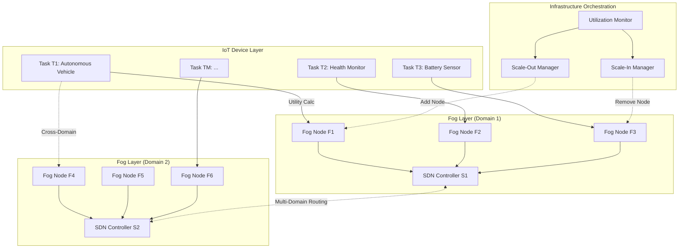

# AC-DL-MATCH System Architecture

> **Technical architecture, algorithms, and implementation details for research project**

---

## 🏗️ System Architecture Overview

AC-DL-MATCH implements a **distributed three-layer architecture** for fog computing task offloading with dynamic infrastructure elasticity.



---

## 📐 Mathematical Formulations

### 1. System Model

#### Task Nodes (T)

```
T = {T₁, T₂, ..., Tₘ}

Each task Tᵢ is characterized by:
Tᵢ = (Sᵢ, χᵢ, τᵢ)

Where:
- Sᵢ ∈ ℝ⁺ : Task data size (MB)
- χᵢ ∈ ℝ⁺ : Computational complexity (CPU cycles)
- τᵢ ∈ {delay-sensitive, energy-critical, mission-critical} : Task type
```

**Task Type Classification**:
```python
τᵢ = {
    'delay-sensitive':   # Autonomous vehicles, AR/VR, real-time gaming
    'energy-critical':   # Battery-powered sensors, wearables
    'mission-critical':  # Healthcare monitors, industrial safety systems
}
```

---

#### Fog Nodes (F)

```
F = {F₁, F₂, ..., Fₙ}

Each fog node Fⱼ is characterized by:
Fⱼ = (fⱼ, memⱼ, Qⱼ, Cⱼ, Rⱼ)

Where:
- fⱼ ∈ ℝ⁺ : CPU frequency (GHz)
- memⱼ ∈ ℝ⁺ : Memory capacity (GB)
- Qⱼ ∈ ℕ : Maximum queue capacity (# concurrent tasks)
- Cⱼ ∈ ℝ⁺ : Cost per bit ($/MB)
- Rⱼ ∈ [0, 1] : Reliability score
```

**Reliability Score Calculation**:
```
Rⱼ⁽ᵗ⁾ = Uptime_j / TotalTime

Where:
- Uptime_j = Cumulative operational time (no failures)
- TotalTime = Total observation period

Historical Uptime Tracking:
R_j^(t+1) = β × R_j^(t) + (1 - β) × I_j^(t)

Where:
- β ∈ [0.9, 0.95] : Smoothing factor
- I_j^(t) ∈ {0, 1} : Indicator (1 if operational, 0 if failed at time t)
```

---

#### SDN Controllers (S)

```
S = {S₁, S₂, ..., Sₖ}

Each SDN controller Sₖ manages a domain:
Sₖ = {Fₖ, Gₖ(Vₖ, Eₖ)}

Where:
- Fₖ ⊂ F : Set of fog nodes in domain k
- Gₖ = (Vₖ, Eₖ) : Network topology graph
  - Vₖ : Vertices (fog nodes)
  - Eₖ : Edges (network connections)
```

**Network Edges**:
```
Each edge eᵢⱼ ∈ E is characterized by:
eᵢⱼ = (δᵢⱼ, pdᵢⱼ, hᵢⱼ)

Where:
- δᵢⱼ ∈ ℝ⁺ : Data rate (Mbps)
- pdᵢⱼ ∈ ℝ⁺ : Propagation delay (ms)
- hᵢⱼ ∈ ℕ : Hop count between nodes i and j
```

---

### 2. Context-Aware Utility Function

#### Standard Utility (Before Modification)

```
U_ij^original = 1 / D_ij - C_ij

Where:
- D_ij : Total delay for task i on fog node j
- C_ij : Monetary cost
```

**Problem**: Ignores energy and reliability, treats all tasks equally.

---

#### Modified Utility (AC-DL-MATCH)

```
U_ij^modified = ω₁^Tᵢ × (1 / D_ij^(t)) + ω₂^Tᵢ × (1 / E_ij^(t)) + ω₃^Tᵢ × R_j^(t) - ω₄^Tᵢ × C_ij^(t)
```

**Component Breakdown**:

##### Delay Component (D_ij)
```
D_ij^(t) = pd_ij + trans_ij + exec_ij

Where:
- pd_ij = Propagation delay (network latency)
- trans_ij = Transmission delay = S_i / δ_ij
- exec_ij = Execution delay = χ_i / f_j
```

##### Energy Component (E_ij)
```
E_ij^(t) = P_tran × (S_i / δ_ij) + P_idle × Q_j^(t)

Where:
- P_tran : Transmission power (Watts)
- P_idle : Idle power consumption of fog node
- Q_j^(t) : Current queue occupancy (# tasks waiting)
```

**Rationale**: Energy = Transmission energy + Waiting energy (fog node idle power while task in queue)

##### Reliability Component (R_j)
```
R_j^(t) = Uptime_j / TotalTime

Already defined above
```

##### Cost Component (C_ij)
```
C_ij^(t) = C_j × S_i^(τ)

Where:
- C_j : Cost per MB at fog node j
- S_i^(τ) : Task size (possibly adjusted by priority)
```

---

#### Task-Specific Weight Assignment (ω^Tᵢ)

```
ω^Tᵢ = {ω₁^Tᵢ, ω₂^Tᵢ, ω₃^Tᵢ, ω₄^Tᵢ}

Weight Assignment Table:

┌──────────────────────┬─────────┬─────────┬─────────┬─────────┐
│ Task Type (τᵢ)       │ ω₁ (D)  │ ω₂ (E)  │ ω₃ (R)  │ ω₄ (C)  │
├──────────────────────┼─────────┼─────────┼─────────┼─────────┤
│ Delay-Sensitive      │  0.6    │  0.1    │  0.2    │  0.1    │
│ Energy-Critical      │  0.2    │  0.5    │  0.2    │  0.1    │
│ Mission-Critical     │  0.3    │  0.1    │  0.5    │  0.1    │
└──────────────────────┴─────────┴─────────┴─────────┴─────────┘

Constraint: Σ ωᵢ = 1.0 (normalized weights)
```

**Example Calculation**:

**Task**: Autonomous vehicle path planning (delay-sensitive, S=2MB, χ=10⁹ cycles)  
**Fog Node**: f=3GHz, mem=8GB, Q=50, C=$0.02/MB, R=0.92, pd=5ms, δ=100Mbps

```
D_ij = 5ms + (2MB / 100Mbps) + (10⁹ / 3×10⁹) 
     = 5ms + 0.16ms + 333ms 
     = 338.16ms

E_ij = 2W × (2 / 100) + 0.5W × 10 
     = 0.04W + 5W 
     = 5.04 Wh

R_j = 0.92

C_ij = 0.02 × 2 = $0.04

U_ij = 0.6 × (1 / 0.33816) + 0.1 × (1 / 5.04) + 0.2 × 0.92 - 0.1 × 0.04
     = 1.774 + 0.0198 + 0.184 - 0.004
     = 1.974
```

---

### 3. Temporal Decay-Weighted Acceptance Probability

#### Standard Acceptance Probability (Before)

```
π_ij^(t) = σ(θᵀ × x_ij^(t))

Where:
- σ(z) = 1 / (1 + e^(-z)) : Sigmoid function
- θ ∈ ℝⁿ : Learned weights (fixed)
- x_ij = [U_ij, q_j, π_ij^history] : Feature vector
```

**Problem**: Historical π_ij^history weighted equally regardless of how old the data is.

---

#### Temporal Decay Modification (AC-DL-MATCH)

```
π_ij^(t) = σ(α × U_ij^(t) + β × π_ij^history × e^(-λ × Δt_ij) + γ × (q_ij^avail / q_ij^total))
```

**Parameter Definitions**:

```
α, β, γ ∈ ℝ⁺ : Learned constants
  Typical values:
  - α = 0.5 (utility weight)
  - β = 0.3 (history weight)
  - γ = 0.2 (availability weight)
  
  Constraint: α + β + γ = 1.0

λ ∈ ℝ⁺ : Decay rate (typically 0.1)
  Controls how fast old data becomes irrelevant

Δt_ij = t_current - t_last_interaction
  Time elapsed since task type i last used fog node j

e^(-λ × Δt_ij) : Exponential decay factor
  - If Δt_ij = 0 (just interacted): e^0 = 1.0 (full weight)
  - If Δt_ij = 10: e^(-0.1×10) = 0.368 (decay to 37%)
  - If Δt_ij = 50: e^(-0.1×50) = 0.007 (nearly zero)

q_ij^avail / q_ij^total : Queue availability ratio
  - q_ij^avail = Q_j - current_occupancy
  - q_ij^total = Q_j (max capacity)
```

**Example Calculation**:

**Scenario**: Task T1 last interacted with Fog Node F1 10 time units ago. Historical success rate = 0.85.

```
U_ij = 1.974 (from previous calculation)
π_ij^history = 0.85
Δt_ij = 10
q_ij^avail = 40 (out of 50 total)

π_ij = σ(0.5 × 1.974 + 0.3 × 0.85 × e^(-0.1×10) + 0.2 × (40/50))
     = σ(0.987 + 0.3 × 0.85 × 0.368 + 0.2 × 0.8)
     = σ(0.987 + 0.094 + 0.16)
     = σ(1.241)
     = 1 / (1 + e^(-1.241))
     = 0.776 (77.6% acceptance probability)
```

---

### 4. k-Hop Locality-Aware Utility

#### Distance Penalty

```
U_ij^k-hop = {
    U_ij^init × (1 - δ × h_ij / k_max)   if h_ij < k_max
    0                                     if h_ij ≥ k_max
}

Where:
- U_ij^init : Initial utility (from context-aware calculation)
- h_ij ∈ ℕ : Network hop count between task T_i and fog node F_j
- k_max ∈ ℕ : Maximum hop threshold (typically 2-3)
- δ ∈ [0, 1] : Distance penalty coefficient (typically 0.8)
```

**Rationale**: Penalize far-away fog nodes to:
1. Reduce latency (fewer hops = faster)
2. Reduce computation (don't calculate utility for distant nodes)
3. Encourage local processing

**Example**:

```
U_ij^init = 1.974
k_max = 3
δ = 0.8

Case 1: h_ij = 1 (one hop away)
U_ij^k-hop = 1.974 × (1 - 0.8 × 1/3) 
           = 1.974 × 0.733 
           = 1.447

Case 2: h_ij = 2 (two hops away)
U_ij^k-hop = 1.974 × (1 - 0.8 × 2/3) 
           = 1.974 × 0.467 
           = 0.921

Case 3: h_ij = 3 (three hops away)
U_ij^k-hop = 1.974 × (1 - 0.8 × 3/3) 
           = 1.974 × 0.2 
           = 0.395

Case 4: h_ij = 4 (beyond threshold)
U_ij^k-hop = 0 (excluded from consideration)
```

---

#### Scalability Analysis

**Complexity Reduction**:

```
Standard DL-MATCH:
- Every task calculates utility for ALL fog nodes
- Complexity: O(M × N)
- Example: 1000 tasks × 100 fog nodes = 100,000 calculations

AC-DL-MATCH (k-hop):
- Every task calculates utility ONLY for nearby fog nodes
- Complexity: O(M × k) where k << N
- Example: 1000 tasks × 5 nearby nodes = 5,000 calculations
- Speedup: 20× faster
```

**SDN Controller Design for k_max Hops**:

```python
class SDNController:
    def __init__(self, domain_id, fog_nodes, topology_graph):
        self.domain_id = domain_id
        self.fog_nodes = fog_nodes  # List of fog nodes in this domain
        self.G = topology_graph     # NetworkX graph
        
        # Precompute all-pairs shortest path distances
        self.hop_distances = dict(nx.all_pairs_shortest_path_length(self.G))
    
    def get_nearby_fog_nodes(self, task_location, k_max=3):
        """
        Return fog nodes within k_max hops of task location.
        
        Returns: List[(fog_node_id, hop_count)]
        """
        nearby = []
        for fog_node in self.fog_nodes:
            hop_count = self.hop_distances[task_location][fog_node.id]
            if hop_count <= k_max:
                nearby.append((fog_node, hop_count))
        return nearby
```

---

### 5. Dynamic Infrastructure Elasticity

#### Scale-Out Policy (Add Fog Nodes)

**Trigger Condition**:
```
IF (ρ_reject^(t) > θ_reject) AND (ρ_cross^(t) < θ_cross):
    Add new fog node F_new
```

**Metric Definitions**:

```
ρ_reject^(t) = (# Rejected Tasks in window W) / (# Total Task Arrivals in window W)

Calculation over sliding window:
ρ_reject = (Σ_{i=t-W}^{t} Rejected_i) / (Σ_{i=t-W}^{t} Arrivals_i)

Where:
- W : Sliding window size (e.g., last 10 time slots)
- Rejected_i : Number of rejected tasks at time i
- Arrivals_i : Number of task arrivals at time i
```

```
ρ_cross^(t) = (# Cross-Domain Successes in window W) / (# Total Rejections in window W)

Calculation:
ρ_cross = (Σ_{i=t-W}^{t} CrossDomain_Success_i) / (Σ_{i=t-W}^{t} Rejected_i)

Where:
- CrossDomain_Success_i : Tasks successfully migrated to other domains at time i
```

**Interpretation**:
- High `ρ_reject` → Many tasks failing locally
- Low `ρ_cross` → Cross-domain migration not helping
- **Action**: Need more local capacity → Add fog node

**Typical Thresholds**:
```
θ_reject = 0.15 to 0.20 (15-20% rejection rate)
θ_cross = 0.40 to 0.50 (40-50% cross-domain success rate)
```

---

#### Scale-In Policy (Remove Fog Nodes)

**Trigger Condition**:
```
IF (μ_j^(t) < θ_util) for duration > θ_time:
    Remove fog node F_j
```

**Average Utilization Calculation**:
```
μ_j^(t) = (1 / W) × Σ_{τ=t-W}^{t} (# Active Tasks on F_j at τ) / Q_j

Where:
- W : Sliding window (e.g., 10 time slots)
- Q_j : Maximum queue capacity of fog node j
```

**Example**:
```
Fog Node F_j: Q_j = 50 (max capacity)

Time slot observations (last 10 slots):
[5, 8, 3, 7, 10, 6, 4, 9, 5, 3] tasks active

μ_j = (1/10) × Σ(5+8+3+7+10+6+4+9+5+3) / 50
    = (1/10) × (60 / 50)
    = 0.12 (12% average utilization)

If θ_util = 0.25 (25% threshold):
    μ_j < θ_util → Fog node underutilized
    
If sustained for θ_time = 10 slots:
    Remove F_j to save energy
```

**Typical Thresholds**:
```
θ_util = 0.20 to 0.30 (20-30% utilization threshold)
θ_time = 5 to 10 time slots (sustained low usage)
```

---

### 6. Cross-Domain Routing

**Decision Logic**:

```
Local_Best_Utility = max_{F_j ∈ Domain_local} U_ij^k-hop

Cross_Domain_Best_Utility = max_{F_j ∈ Domain_other} U_ij^k-hop

IF (Local_Best_Utility < Cross_Domain_Best_Utility × Threshold_Factor):
    Migrate task to cross-domain fog node
ELSE:
    Stay in local domain
```

**Threshold Factor**: Typically 0.8-0.9 (hysteresis to avoid oscillation)

**Rationale**: Only migrate if cross-domain option is **significantly better** (not just marginally), to avoid frequent domain switches.

---

## 🔄 Algorithm Phases

### Phase 1: Initialization

```python
def initialize_system():
    """
    System startup: Load topology, initialize fog nodes, SDN controllers.
    """
    # 1. Load network topology from configuration
    topology = load_topology_config("network_topology.json")
    
    # 2. Initialize fog nodes with capacities
    fog_nodes = []
    for config in topology['fog_nodes']:
        fog_node = FogNode(
            id=config['id'],
            cpu_freq=config['cpu_freq'],
            memory=config['memory'],
            queue_capacity=config['queue_capacity'],
            cost_per_mb=config['cost_per_mb'],
            reliability=config['initial_reliability']
        )
        fog_nodes.append(fog_node)
    
    # 3. Initialize SDN controllers (one per domain)
    sdn_controllers = []
    for domain_config in topology['domains']:
        sdn = SDNController(
            domain_id=domain_config['id'],
            fog_nodes=[f for f in fog_nodes if f.id in domain_config['fog_node_ids']],
            topology_graph=build_graph(domain_config['edges'])
        )
        sdn_controllers.append(sdn)
    
    # 4. Initialize infrastructure orchestration
    scale_out_manager = ScaleOutManager(
        rejection_threshold=0.18,
        cross_domain_threshold=0.45
    )
    
    scale_in_manager = ScaleInManager(
        utilization_threshold=0.25,
        time_threshold=10
    )
    
    return fog_nodes, sdn_controllers, scale_out_manager, scale_in_manager
```

---

### Phase 2: Task Arrival & Utility Calculation

```python
def handle_task_arrival(task, sdn_controllers, k_max=3):
    """
    When a task arrives, calculate utility for nearby fog nodes.
    
    Args:
        task: Task object with (size, complexity, type)
        sdn_controllers: List of SDN controllers
        k_max: Maximum hop distance threshold
    
    Returns:
        ranked_fog_nodes: List of (fog_node, utility) tuples sorted by utility
    """
    # 1. Identify task's local SDN domain
    local_sdn = get_local_sdn_controller(task.source_location, sdn_controllers)
    
    # 2. Get nearby fog nodes (within k_max hops)
    nearby_fog_nodes = local_sdn.get_nearby_fog_nodes(task.source_location, k_max)
    
    # 3. Calculate utility for each nearby fog node
    utilities = []
    for fog_node, hop_count in nearby_fog_nodes:
        # 3a. Calculate base utility (context-aware)
        U_base = calculate_context_aware_utility(
            task=task,
            fog_node=fog_node,
            hop_count=hop_count
        )
        
        # 3b. Apply k-hop distance penalty
        U_penalized = apply_distance_penalty(
            U_base, 
            hop_count, 
            k_max, 
            delta=0.8
        )
        
        utilities.append((fog_node, U_penalized))
    
    # 4. Rank fog nodes by utility (descending)
    ranked_fog_nodes = sorted(utilities, key=lambda x: x[1], reverse=True)
    
    return ranked_fog_nodes
```

---

### Phase 3: Matching & Acceptance Decision

```python
def match_task_to_fog_node(task, ranked_fog_nodes):
    """
    Iterate through ranked fog nodes, attempt matching via acceptance probability.
    
    Args:
        task: Task object
        ranked_fog_nodes: List of (fog_node, utility) sorted by utility
    
    Returns:
        matched_fog_node: Fog node that accepted the task (or None if all rejected)
    """
    for fog_node, utility in ranked_fog_nodes:
        # 1. Calculate temporal decay-weighted acceptance probability
        acceptance_prob = calculate_acceptance_probability(
            task=task,
            fog_node=fog_node,
            utility=utility
        )
        
        # 2. Stochastic acceptance decision
        if random.random() < acceptance_prob:
            # 2a. Check capacity constraint
            if fog_node.current_queue < fog_node.queue_capacity:
                # Accept task
                fog_node.add_task(task)
                return fog_node
            else:
                # Queue full, reject despite high probability
                continue
        else:
            # Rejected by acceptance probability
            continue
    
    # All local fog nodes rejected
    return None
```

---

### Phase 4: Cross-Domain Migration (If Local Fails)

```python
def attempt_cross_domain_migration(task, sdn_controllers, k_max=3):
    """
    If local domain rejects task, attempt migration to other domains.
    
    Args:
        task: Task object
        sdn_controllers: List of all SDN controllers (all domains)
        k_max: Maximum hop distance threshold
    
    Returns:
        matched_fog_node: Fog node from another domain (or None if all reject)
    """
    # 1. Identify task's local domain
    local_sdn = get_local_sdn_controller(task.source_location, sdn_controllers)
    
    # 2. Get other domains
    other_domains = [sdn for sdn in sdn_controllers if sdn != local_sdn]
    
    # 3. Calculate utilities in each domain
    cross_domain_options = []
    for sdn in other_domains:
        ranked_fog_nodes = handle_task_arrival(task, [sdn], k_max)
        if ranked_fog_nodes:
            best_fog_node, best_utility = ranked_fog_nodes[0]
            cross_domain_options.append((best_fog_node, best_utility, sdn))
    
    # 4. Rank cross-domain options
    cross_domain_options = sorted(cross_domain_options, key=lambda x: x[1], reverse=True)
    
    # 5. Apply threshold factor (hysteresis)
    threshold_factor = 0.85  # Only migrate if 15% better than best local option
    local_best_utility = get_local_best_utility(task, local_sdn, k_max)
    
    for fog_node, utility, sdn in cross_domain_options:
        if utility > local_best_utility * threshold_factor:
            # Attempt match with this cross-domain fog node
            matched = match_task_to_fog_node(task, [(fog_node, utility)])
            if matched:
                # Log cross-domain migration
                log_cross_domain_success(task, fog_node, sdn)
                return matched
    
    # All cross-domain options also rejected
    return None
```

---

### Phase 5: Scale-Out Decision (Infrastructure Elasticity)

```python
def check_scale_out_trigger(scale_out_manager, metrics_window):
    """
    Check if scale-out conditions are met.
    
    Args:
        scale_out_manager: ScaleOutManager instance
        metrics_window: Recent metrics (last W time slots)
    
    Returns:
        should_scale_out: Boolean
    """
    # 1. Calculate rejection rate over window
    total_arrivals = sum(m['arrivals'] for m in metrics_window)
    total_rejections = sum(m['rejections'] for m in metrics_window)
    rejection_rate = total_rejections / total_arrivals if total_arrivals > 0 else 0
    
    # 2. Calculate cross-domain success rate
    total_cross_domain = sum(m['cross_domain_success'] for m in metrics_window)
    cross_domain_rate = total_cross_domain / total_rejections if total_rejections > 0 else 0
    
    # 3. Check trigger conditions
    if (rejection_rate > scale_out_manager.rejection_threshold and 
        cross_domain_rate < scale_out_manager.cross_domain_threshold):
        return True
    
    return False

def execute_scale_out(domain_sdn, new_fog_node_config):
    """
    Add a new fog node to the domain.
    
    Args:
        domain_sdn: SDN controller for the domain
        new_fog_node_config: Configuration for new fog node
    """
    # 1. Provision new fog node
    new_fog_node = FogNode(
        id=new_fog_node_config['id'],
        cpu_freq=new_fog_node_config['cpu_freq'],
        memory=new_fog_node_config['memory'],
        queue_capacity=new_fog_node_config['queue_capacity'],
        cost_per_mb=new_fog_node_config['cost_per_mb'],
        reliability=0.95  # Initial reliability estimate
    )
    
    # 2. Add to SDN controller's fog node list
    domain_sdn.fog_nodes.append(new_fog_node)
    
    # 3. Update network topology (connect to nearby nodes)
    domain_sdn.update_topology_with_new_node(new_fog_node)
    
    # 4. Log event
    log_scale_out_event(new_fog_node, domain_sdn)
```

---

### Phase 6: Scale-In Decision (Remove Underutilized Nodes)

```python
def check_scale_in_candidates(scale_in_manager, fog_nodes, metrics_history):
    """
    Identify fog nodes eligible for removal (sustained low utilization).
    
    Args:
        scale_in_manager: ScaleInManager instance
        fog_nodes: List of all fog nodes
        metrics_history: Historical utilization data
    
    Returns:
        candidates: List of fog nodes to remove
    """
    candidates = []
    
    for fog_node in fog_nodes:
        # 1. Calculate average utilization over window
        utilization_history = metrics_history[fog_node.id][-scale_in_manager.time_threshold:]
        avg_utilization = sum(utilization_history) / len(utilization_history)
        
        # 2. Check if below threshold for sustained period
        if avg_utilization < scale_in_manager.utilization_threshold:
            if len(utilization_history) >= scale_in_manager.time_threshold:
                # Sustained low utilization
                candidates.append(fog_node)
    
    return candidates

def execute_scale_in(domain_sdn, fog_node_to_remove):
    """
    Remove an underutilized fog node.
    
    Args:
        domain_sdn: SDN controller for the domain
        fog_node_to_remove: Fog node to remove
    """
    # 1. Migrate active tasks to other nodes (if any)
    if fog_node_to_remove.current_queue > 0:
        migrate_active_tasks(fog_node_to_remove, domain_sdn.fog_nodes)
    
    # 2. Remove from SDN controller's fog node list
    domain_sdn.fog_nodes.remove(fog_node_to_remove)
    
    # 3. Update network topology (remove connections)
    domain_sdn.update_topology_remove_node(fog_node_to_remove)
    
    # 4. Log event
    log_scale_in_event(fog_node_to_remove, domain_sdn)
```

---

## 📊 Simulation Architecture

### iFogSim Integration

**iFogSim Framework**: Java-based fog computing simulator with event-driven architecture.

#### Custom Modules for AC-DL-MATCH

```java
// 1. AC_DL_MATCH_TaskOffloading.java
public class AC_DL_MATCH_TaskOffloading extends TaskOffloadingPolicy {
    private Map<String, Double> contextWeights;  // Task-type specific weights
    private TemporalDecayCalculator decayCalc;
    private KHopLocalityManager localityMgr;
    
    @Override
    public FogNode selectFogNode(Task task, List<FogNode> availableNodes) {
        // 1. Filter nearby nodes (k-hop)
        List<FogNode> nearbyNodes = localityMgr.filterByHopDistance(task, availableNodes, 3);
        
        // 2. Calculate utilities with context-aware weights
        Map<FogNode, Double> utilities = calculateUtilities(task, nearbyNodes);
        
        // 3. Rank by utility
        List<FogNode> ranked = rankByUtility(utilities);
        
        // 4. Iterate through ranked nodes, check acceptance probability
        for (FogNode node : ranked) {
            double acceptProb = decayCalc.calculateAcceptanceProbability(
                task, node, utilities.get(node)
            );
            
            if (Math.random() < acceptProb && node.hasCapacity()) {
                return node;  // Matched
            }
        }
        
        return null;  // All rejected
    }
}

// 2. InfrastructureElasticityManager.java
public class InfrastructureElasticityManager {
    private double rejectionThreshold = 0.18;
    private double crossDomainThreshold = 0.45;
    private double utilizationThreshold = 0.25;
    
    public void checkScaleOutTrigger(MetricsWindow metrics) {
        double rejectionRate = metrics.getRejectionRate();
        double crossDomainRate = metrics.getCrossDomainRate();
        
        if (rejectionRate > rejectionThreshold && crossDomainRate < crossDomainThreshold) {
            executeScaleOut();
        }
    }
    
    public void checkScaleInCandidates(List<FogNode> nodes, MetricsHistory history) {
        for (FogNode node : nodes) {
            double avgUtilization = history.getAverageUtilization(node, 10);
            
            if (avgUtilization < utilizationThreshold) {
                executeScaleIn(node);
            }
        }
    }
}
```

---

### Python Algorithm Implementation

**For detailed utility calculations and ML components**:

```python
# algorithms/context_aware_utility.py

import numpy as np
from typing import Dict, Tuple

class ContextAwareUtilityCalculator:
    """
    Calculate context-aware multi-objective utility for task-fog node pairs.
    """
    
    # Task-type specific weight configurations
    WEIGHT_CONFIGS = {
        'delay-sensitive': {'w1': 0.6, 'w2': 0.1, 'w3': 0.2, 'w4': 0.1},
        'energy-critical': {'w1': 0.2, 'w2': 0.5, 'w3': 0.2, 'w4': 0.1},
        'mission-critical': {'w1': 0.3, 'w2': 0.1, 'w3': 0.5, 'w4': 0.1},
    }
    
    def __init__(self, 
                 transmission_power: float = 2.0,  # Watts
                 idle_power: float = 0.5):         # Watts
        self.P_tran = transmission_power
        self.P_idle = idle_power
    
    def calculate_delay(self, 
                       task_size: float,        # MB
                       complexity: float,       # CPU cycles
                       data_rate: float,        # Mbps
                       propagation_delay: float,# ms
                       fog_cpu_freq: float):    # GHz
        """Calculate total delay: propagation + transmission + execution."""
        
        # Propagation delay (ms)
        pd = propagation_delay
        
        # Transmission delay (ms)
        trans = (task_size * 8) / (data_rate * 1000)  # Convert MB to bits, Mbps to bps
        
        # Execution delay (ms)
        exec_delay = (complexity / (fog_cpu_freq * 1e9)) * 1000  # Convert to ms
        
        total_delay = pd + trans + exec_delay
        return total_delay
    
    def calculate_energy(self, 
                        task_size: float,
                        data_rate: float,
                        queue_occupancy: int):
        """Calculate energy consumption: transmission + idle waiting."""
        
        # Transmission energy (Wh)
        trans_energy = self.P_tran * (task_size / data_rate)
        
        # Idle waiting energy (Wh) - proportional to queue length
        idle_energy = self.P_idle * queue_occupancy
        
        total_energy = trans_energy + idle_energy
        return total_energy
    
    def calculate_utility(self, 
                         task: Dict,
                         fog_node: Dict,
                         network_params: Dict) -> float:
        """
        Calculate modified context-aware utility.
        
        Args:
            task: {'size': float, 'complexity': float, 'type': str}
            fog_node: {'cpu_freq': float, 'queue': int, 'reliability': float, 'cost': float}
            network_params: {'data_rate': float, 'prop_delay': float, 'hop_count': int}
        
        Returns:
            utility: float (higher is better)
        """
        # Get task-specific weights
        weights = self.WEIGHT_CONFIGS[task['type']]
        
        # Calculate delay component
        delay = self.calculate_delay(
            task['size'], 
            task['complexity'],
            network_params['data_rate'],
            network_params['prop_delay'],
            fog_node['cpu_freq']
        )
        
        # Calculate energy component
        energy = self.calculate_energy(
            task['size'],
            network_params['data_rate'],
            fog_node['queue']
        )
        
        # Reliability component
        reliability = fog_node['reliability']
        
        # Cost component
        cost = fog_node['cost'] * task['size']
        
        # Combined utility
        utility = (
            weights['w1'] * (1 / delay) +
            weights['w2'] * (1 / energy) +
            weights['w3'] * reliability -
            weights['w4'] * cost
        )
        
        return utility
```

---

## 🔧 Implementation Roadmap

### Phase 1: Core Algorithm (Weeks 1-4)
- [ ] Implement context-aware utility calculation
- [ ] Implement temporal decay acceptance probability
- [ ] Implement k-hop locality filtering
- [ ] Unit tests for all components

### Phase 2: Infrastructure Elasticity (Weeks 5-6)
- [ ] Implement scale-out policy
- [ ] Implement scale-in policy
- [ ] Metrics collection and monitoring

### Phase 3: Multi-Domain Support (Weeks 7-8)
- [ ] Implement cross-domain routing
- [ ] SDN controller coordination
- [ ] Domain handoff protocols

### Phase 4: iFogSim Integration (Weeks 9-10)
- [ ] Java wrapper for Python algorithms
- [ ] Custom iFogSim modules
- [ ] Integration testing

### Phase 5: Evaluation & Experiments (Weeks 11-12)
- [ ] Run baseline comparisons
- [ ] Collect performance metrics
- [ ] Generate graphs and analysis

---

## 📏 Performance Benchmarks

### Target Metrics

| Metric | AC-DL-MATCH Target | Baseline (Static) |
|--------|-------------------|-------------------|
| Avg. Task Latency | <50ms | ~150ms |
| Task Acceptance Rate | >85% | ~60% |
| Energy Consumption | -35% reduction | Baseline (100%) |
| Infrastructure Utilization | 60-80% | 40% (over-provisioned) |
| Scale-Out Latency | <5s | Manual (hours) |
| Decision Complexity | O(M×k) | O(M×N) |

---

## 🔗 Related Documentation

- [README.md](./README.md) - Project overview and domain knowledge
- `/matching/` - Python unified simulation architecture
- `/matching/algorithms/` - Core simulation algorithm definitions
- `/docs/` - Additional technical documentation

---

**Architecture Version**: 1.0  
**Last Updated**: February 2025  
**Maintained by**: AC-DL-MATCH Research Team
