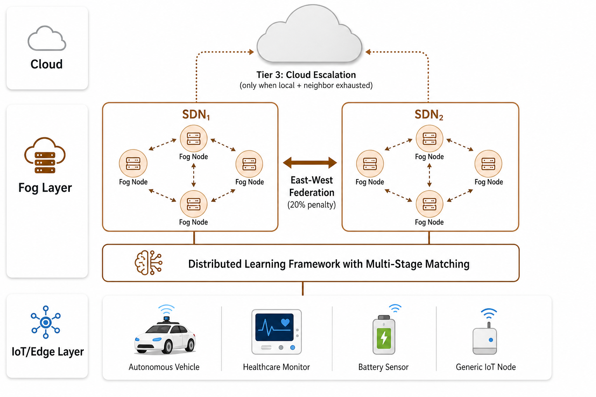
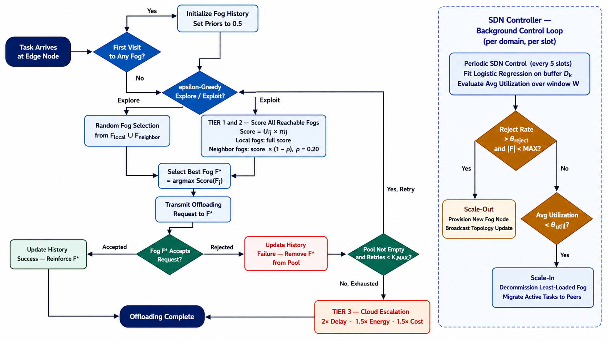

# Adaptive Context-Aware Task Offloading with Dynamic Infrastructure Elasticity in Multi-Domain SDN-Enabled Fog Computing Networks

**Pratham Rajesh Aggarwal** (22JE0718)
B.Tech. Computer Science and Engineering
Indian Institute of Technology (Indian School of Mines) Dhanbad

**Supervisor:** Prof. Prasanta K. Jana
Department of Computer Science and Engineering, IIT(ISM) Dhanbad
Academic Year 2025–2026

---

## Abstract

IoT devices today generate enormous amounts of data that need to be processed almost instantly---think smart cameras, health monitors, or vehicle sensors. Cloud computing is too far away to keep up, so fog computing steps in by placing small computing nodes closer to the devices. The challenge, however, is deciding which device should send its work to which fog node, and when.

This report presents **AC-DL-MATCH** (Adaptive Context-Aware Distributed Learning Matching), a framework built on top of the existing DL-MATCH algorithm [1]. It improves on its predecessor in five concrete ways: each device gets to express its own priorities (speed, energy, reliability, or cost) and the system respects those priorities when making decisions; old data about fog nodes is gradually forgotten so decisions stay accurate over time; if one local area is overloaded, tasks are automatically forwarded to a neighbouring network zone; the number of fog nodes in service can grow or shrink automatically based on real demand; and each network zone learns from its own experience without sharing private data with others.

Tested over 500 simulated time steps against seven other approaches---including deep reinforcement learning and particle swarm optimisation---AC-DL-MATCH accepted the most tasks (~44.5%), achieved the lowest delay (~197 ms), used the least energy (~42 J), and cost the least (~21.5 units), while accumulating the highest overall system utility (~4980).

**Keywords:** Fog computing, task offloading, matching theory, distributed learning, infrastructure elasticity, SDN federation, context-aware utility.

---

## I. Introduction

The number of connected IoT devices---sensors, cameras, vehicles, medical monitors---has grown at a pace that cloud computing was simply not designed to handle. When a smart car's braking system or a hospital's ECG monitor needs a decision in under 50 milliseconds, sending data all the way to a remote data centre and back (typically 100–500 ms round-trip) is not fast enough [2, 3]. Fog computing tackles this by placing small computing nodes much closer to the devices, cutting down the distance data has to travel.

Within this setup, **task offloading** is the process by which a device with limited processing power hands off a job to a nearby fog node [6]. This sounds simple, but in practice it is not. The fog landscape is made up of many different machines with different speeds and capacities, the load on each node changes from moment to moment, and devices have very different needs. A poorly designed offloading strategy leads to bottlenecks when traffic suddenly spikes, wasted energy when nodes sit idle, and broken service guarantees for end users.

The most relevant prior work is DL-MATCH by Tran-Dang and Kim [1], which pairs a matching-theory approach with logistic regression to help devices learn which fog nodes are likely to accept their tasks. It outperforms earlier methods, but it has four gaps that prevent it from working well in the real world:

1. **One-size-fits-all decisions.** DL-MATCH uses the same formula for every task---whether it is a latency-critical vehicle or a low-priority temperature sensor---ignoring the fact that different devices have different needs.
2. **Mixing incomparable numbers.** Combining raw milliseconds with raw cost fractions in a single score distorts the result because the two quantities are on completely different scales.
3. **Fixed number of fog nodes.** When demand spikes, DL-MATCH cannot add more fog capacity; when demand drops, it cannot remove idle nodes to save power.
4. **No way out when a zone is full.** If every node in a local area is busy, DL-MATCH has no fallback other than sending the task to the cloud---the slowest and most expensive option.

This project addresses all four gaps with **AC-DL-MATCH**, a lightweight and fully distributed framework that runs on low-power hardware without any central controller. Its five main contributions are:

- A scoring formula that respects each device's declared priorities, normalised so that delay, energy, reliability, and cost are all comparable (Section IV-A).
- A memory system that gives more weight to recent experience and gradually forgets stale information (Section IV-B).
- A unified ranked-pool routing model where local and neighbour fog nodes are scored in one pass and East-West migration is emergent, not gated (Section IV-C).
- Automatic scaling: new nodes are added when a zone is overwhelmed and idle nodes are switched off when not needed (Section IV-D).
- Each network zone learns from its own data independently, with no data shared between zones (Section IV-E).

The rest of this report covers: related work (II), system model (III), framework design (IV), simulation setup (V), results (VI), and conclusion (VII).

---

## II. Related Work

Research on fog task offloading broadly falls into three groups: classical optimisation methods, reinforcement learning, and matching-based approaches.

**Classical Optimisation.** Integer Linear Programming (ILP) finds the mathematically best assignment of tasks to fog nodes, but the time it takes grows rapidly with the number of devices and nodes. At the scale of a smart city deployment, it becomes impractical. Fuzzy logic and convex optimisation methods are faster but depend on fixed configuration parameters that stop working well once conditions change.

**Deep Reinforcement Learning.** DRL agents learn by trial and error over many thousands of rounds [4, 5]. They can handle complex, changing environments, but they need an enormous amount of training before they are useful---far more than what a small fog node can afford---and they typically assume a single central trainer, which is at odds with how fog networks actually operate.

**Bandit Methods.** MV-UCB and BLM-TS are much lighter than DRL. They treat each fog node as a slot machine and use statistical methods to decide which ones to try. The problem is that they give every past interaction the same weight, so a fog node that worked well six months ago still looks good even if it has been getting slower recently.

**DL-MATCH [1].** This is the direct starting point for the current project. It combines one-to-many matching theory with a logistic regression model that each device trains on its own offloading history. It outperforms MV-UCB and BLM-TS and achieves around 0.8 task acceptance rate on a 10×5 device-to-node setup. However, it only optimises for delay and cost, treats the fog topology as fixed, and works within a single network zone. AC-DL-MATCH was built specifically to address these gaps.

**Table I. Comparison of Related Approaches**

| Work | Approach | Scalability | Multi-metric | Elastic | Multi-zone |
|------|----------|:-----------:|:------------:|:-------:|:----------:|
| DL-MATCH [1] | Matching + LR | O(M×N) | Delay+Cost | No | No |
| MV-UCB | Bandit (UCB) | O(M×N) | Single | No | No |
| BLM-TS | Bandit (TS) | O(M×N) | Single | No | No |
| DRL [4] | Deep Q-Net | O(N²) train | Learned | No | No |
| ILP | Convex opt. | NP-hard | Variable | No | No |
| PSO | Metaheuristic | O(N×p) | Variable | No | No |
| **AC-DL-MATCH** | **Matching + LR** | **O(M×k)** | **4-metric** | **Yes** | **Yes** |

---

## III. System Model and Problem Formulation

### A. Network Model

The system is modelled as a time-slotted network running over T = 500 discrete time steps. It has three kinds of participants.

**IoT Devices (Task Nodes).** There are M = 75 edge devices, each generating a task at most time steps according to a Poisson arrival process (average rate λ = 0.8 tasks per slot). Each task carries a data size $S_i$ (MB), a compute requirement $\chi_i$ (CPU cycles), and a weight vector $\mathbf{w}_i = (w_1, w_2, w_3, w_4)$ that expresses how much the device cares about delay, energy, reliability, and cost respectively. These weights are drawn at random from integers between 1 and 10, covering a realistic mix of device types.

**Fog Nodes.** The network starts with 15 fog nodes across three zones (5 per zone). Each node $F_j$ has a processing frequency $f_j$, queue limit $Q_j$, cost per task $C_j$, and reliability score $R_j$. The total number of fog nodes can change during a run via the elasticity mechanism (Section IV-D).

**SDN Controllers.** Each zone is managed by a Software-Defined Networking (SDN) controller that tracks fog node status, maintains a record of recent network performance for every device-to-fog pair, and coordinates with neighbouring controllers for cross-zone forwarding.



### B. Optimisation Objective

Let $x_{ij}^{(t)} = 1$ if task $i$ is assigned to fog $j$ at time $t$, else 0. The objective is:

$$\underset{x_{ij}^{(t)}}{\max} \quad \sum_{t=1}^{T} \sum_{i=1}^{M} \sum_{j=1}^{N} x_{ij}^{(t)} \cdot \Bigl[ U_{ij}^{(t)} \times \pi_{ij}^{(t)} \Bigr]$$

where $U_{ij}^{(t)}$ is the match quality (Section IV-A) and $\pi_{ij}^{(t)}$ is the acceptance probability estimate (Section IV-B).

**Table II. Problem Constraints**

| Constraint | Mathematical Form | What it means |
|-----------|------------------|---------------|
| One assignment | $x_{ij}^{(t)} \in \{0,1\},\ \forall i,j,t$ | Each task goes to at most one fog node |
| Queue limit | $\sum_{i} x_{ij}^{(t)} \leq Q_j,\ \forall j,t$ | A fog cannot take more than its queue allows |
| Zone reachability | $F_j \in \mathcal{F}_{\text{local}} \cup \mathcal{F}_{\text{neighbour}},\ \forall i,j$ | Devices reach only local or adjacent zone fogs |

This is an NP-hard Mixed-Integer Nonlinear Program [1]. AC-DL-MATCH solves it via a distributed matching heuristic with complexity O(M×k), where k is the number of reachable fogs---a small number bounded by the zone topology.

---

## IV. Proposed Framework: AC-DL-MATCH

### A. Priority-Aware Utility Scoring

The original DL-MATCH uses $U_{ij} = 1/D_{ij} - C_{ij}$, which mixes milliseconds and cost fractions---two quantities on completely different scales. The delay term dominates by orders of magnitude regardless of what a device actually needs.

AC-DL-MATCH fixes this by normalising every metric to a [0, 1] score on each device independently, with no cross-device communication:

$$X'_{ij} = \max\!\left(0,\; 1 - \frac{X_{ij}}{X_{\max}}\right)$$

Applied to the four metrics:

$$D'_{ij} = \max\!\left(0, 1 - \frac{D_{ij}}{D_{\max}}\right), \qquad E'_{ij} = \max\!\left(0, 1 - \frac{E_{ij}}{E_{\max}}\right)$$

$$R'_{j} = \min\!\left(R_j,\; 1.0\right), \qquad C'_{ij} = \max\!\left(0, 1 - \frac{C_{ij}}{C_{\max}}\right)$$

The final score is a weighted average using the device's own priorities $\mathbf{w}_i = (w_1, w_2, w_3, w_4)$:

$$U_{ij}^{(t)} = \frac{w_1\, D'_{ij} + w_2\, E'_{ij} + w_3\, R'_j + w_4\, C'_{ij}}{w_1 + w_2 + w_3 + w_4}$$

A vehicle with weights (9, 2, 3, 1) will strongly prefer the fastest fog. A battery sensor with weights (2, 9, 3, 1) will prefer the most energy-efficient one.

**Table III. Example Device Priority Profiles**

| Profile | w₁ (Delay) | w₂ (Energy) | w₃ (Reliability) | w₄ (Cost) | Primary concern |
|---------|:----------:|:-----------:|:----------------:|:---------:|-----------------|
| Speed-first | 9 | 2 | 3 | 1 | Fast response (vehicles, AR/VR) |
| Energy-first | 2 | 9 | 3 | 1 | Low power use (battery sensors) |
| Reliability-first | 3 | 2 | 9 | 1 | Consistent uptime (healthcare) |

### B. Forgetting Stale History

DL-MATCH keeps a running average of all past outcomes and treats old interactions the same as recent ones. In a real fog network where performance changes over time, this leads to poor decisions.

AC-DL-MATCH uses exponential forgetting. Let $\Delta t_{ij}$ be the number of steps since the last interaction with fog $F_j$:

$$\hat{\pi}_{ij}^{(t)} = \pi_{ij}^{\text{history}} \cdot e^{-\lambda \Delta t_{ij}} + 0.5 \cdot \left(1 - e^{-\lambda \Delta t_{ij}}\right)$$

Old data fades over time and the estimate drifts back to 0.5 (''don't know'') when a fog has not been visited recently. With λ = 0.1, history from 10 steps ago still counts for about 37%, but history from 50 steps ago contributes less than 1%.

The acceptance probability estimate is then:

$$\pi_{ij}^{(t)} = \sigma\!\left(\alpha \cdot U_{ij}^{(t)} + \beta \cdot \hat{\pi}_{ij}^{(t)} + \gamma \cdot \frac{q_j^{\text{avail}}}{Q_j}\right)$$

where σ(·) is the sigmoid function and (α, β, γ) are learned by the local SDN controller (Section IV-E).

### C. Tiered Task Routing

Rather than scanning the entire network, AC-DL-MATCH builds one unified candidate pool at the start of every offloading attempt:

$$\mathcal{F}_{\text{avail}} = \mathcal{F}_{\text{local}} \cup \mathcal{F}_{\text{neighbour}}$$

Every fog in this pool is scored in a single pass. Local fogs are scored at face value; neighbour fogs take a 20% cross-zone penalty:

$$\text{Score}_{ij} = \begin{cases} U_{ij}^{(t)} \cdot \pi_{ij}^{(t)} & F_j \in \mathcal{F}_{\text{local}} \\ U_{ij}^{(t)} \cdot (1 - \rho) \cdot \pi_{ij}^{(t)},\ \rho = 0.20 & F_j \in \mathcal{F}_{\text{neighbour}} \end{cases}$$

The three routing tiers emerge naturally from this ranking. In normal conditions, local fogs score higher because they pay no penalty (**Tier 1**). As a local zone fills up, its fogs accumulate rejection history, their acceptance probabilities fall, and a neighbour fog's penalised score can overtake them---East-West migration happens automatically without a separate retry phase (**Tier 2**). Only after K_max = 3 combined rejections across the full pool, or when the pool is empty, does the task go to the cloud at 2× delay, 1.5× energy, and 1.5× cost (**Tier 3**).



**The East-West Scaling Paradox.** An early version added a hard floor: only consider a neighbour fog if its penalised score still exceeded 0.30. During a traffic spike, every locally-rejected task probed the neighbours at the same time---and because of the penalty, most hit the floor and fell straight to the cloud, even though the neighbours were perfectly usable. Removing the floor and letting tasks compete on relative ranks fixed the problem and reduced search complexity from O(M×N) to O(M×k), where k = |F_avail| ≪ N.

### D. Automatic Scaling

Most fog frameworks assume a fixed number of fog nodes. AC-DL-MATCH grows and shrinks as demand changes.

**Adding a node.** If a zone rejects more than 10% of tasks over the last five steps, a new fog node is provisioned (up to 10 per zone):

$$\rho_{\text{reject}}^{(t)} = \frac{\sum_{s=t-W}^{t} \text{Rejected}_s}{\sum_{s=t-W}^{t} \text{Arrivals}_s} > \theta_{\text{reject}}$$

**Removing a node.** If the least-used node runs below 30% capacity for five consecutive steps, it is switched off and its tasks are migrated first:

$$\bar{\mu}_j^{(t)} = \frac{1}{W} \sum_{s=t-W}^{t} \frac{\text{ActiveTasks}_j(s)}{Q_j} < \theta_{\text{util}}$$

Thresholds: θ_reject = 0.10, θ_util = 0.30, W = 5 steps.

### E. Learning Within Each Zone

Each SDN controller keeps its own log of offloading outcomes---up to 2000 recent entries. Every five time steps it retrains a logistic regression model on that log to update (α, β, γ) for the acceptance probability formula. Each zone adapts independently to its own traffic patterns without sharing data with others.

---

## V. Simulation Setup and Implementation

### A. Simulation Platform

The simulation is written in Python using NumPy for numerical computation, Scikit-learn for logistic regression, and PyTorch for the DRL baseline. Fog node capacity drifts with ±5% noise per step (Ornstein-Uhlenbeck process). Task arrivals follow a Poisson process (λ = 0.8), creating natural bursts rather than a uniform stream.

### B. Simulation Parameters

**Table IV. Simulation Configuration**

| Parameter | Value | What it controls |
|-----------|:-----:|-----------------|
| Time steps (T) | 500 | Length of simulation run |
| SDN Zones (P) | 3 | Each zone has its own controller |
| Starting fog nodes / zone | 5 | Initial capacity |
| Maximum fog nodes / zone | 10 | Scale-out ceiling |
| IoT devices (M) | 75 | Active task generators |
| Task arrival rate (λ) | 0.8 | Average tasks per time step |
| Max retries before cloud | 3 | Attempts before cloud fallback |
| Zone topology | Ring | Each zone neighbours two others |
| Cross-zone penalty (ρ) | 0.20 | Score reduction for neighbour fogs |
| Forgetting rate (λ_d) | 0.1 | Exponential decay constant |
| Add-node threshold | 10% rejection | Triggers scale-out |
| Remove-node threshold | 30% utilisation | Triggers scale-in |
| Learning frequency | Every 5 steps | When LR model is retrained |
| Max history buffer | 2000 records | Per-zone training data cap |
| Max delay SLA (D_max) | 100 ms | Normalisation upper bound |
| Max energy SLA (E_max) | 30 J | Normalisation upper bound |
| Max cost SLA (C_max) | 15 units | Normalisation upper bound |
| Fog node reliability | 0.90 | Default link reliability |

### C. Baseline Algorithms

Seven approaches were tested against AC-DL-MATCH on the same network configuration and random seed:

1. **RANDOM** — Picks a fog node at random. Lower-bound reference.
2. **GREEDY** — Always picks the highest-scoring node, no learning.
3. **BLM-TS** — Beta-distribution Thompson Sampling.
4. **MV-UCB** — Upper Confidence Bound with exploration bonus (C=1.5).
5. **ORIGINAL_DL_MATCH** — Direct implementation of [1]; two-metric utility, flat-history LR.
6. **DRL** — Deep Q-Network, two 64-neuron hidden layers, 100,000-sample replay buffer.
7. **META_PSO** — Particle Swarm Optimisation, 10 particles, 10 iterations per step.

### D. Core Algorithm Pseudocode

**Algorithm 1: AC-DL-MATCH Task Offloading**

```
Input:  Device T_i, time step t, zone controller K_p
Output: success  OR  Tier-3 cloud escalation

F_avail ← F_local ∪ F_neighbour        // unified pool; neighbours tagged is_neighbour
ξ ~ U(0,1);  ε ← 0.5 · exp(-0.1·t)    // decaying exploration rate

for attempt k = 1 to K_max:
    if F_avail is empty: break

    if ξ < ε:
        F* ← random fog from F_avail   // Explore

    else:
        for each F_j in F_avail:
            U_ij ← ContextUtility(F_j, w_i)   // SLA-bounded 4-metric utility
            if is_neighbour(F_j):
                U_ij ← U_ij × (1 - ρ)         // Tier 2: 20% cross-zone penalty
            Δt_ij ← t - t_last[F_j]
            π_hat_ij ← π_hist[F_j] · exp(-0.1·Δt) + 0.5·(1 - exp(-0.1·Δt))
            π_ij ← sigmoid(α·U_ij + β·π_hat_ij + γ·q_avail/Q_j)
            score[F_j] ← U_ij · π_ij
        F* ← argmax score              // Best fog across Tier 1 and Tier 2

    y ← simulate acceptance by F*
    log ([U_ij, π_hat_ij, q_avail], y) to D_k
    update t_last[F*], π_hist[F*]
    if y == 1: return success
    remove F* from F_avail

return Tier-3: cloud escalation
```

**Algorithm 2: Zone Elasticity and Learning**

```
Input:  Zone fog set F_k, rejection rate ρ, utilisation window W

if ρ > θ_reject  AND  |F_k| < MAX:
    add new fog node to F_k
    notify all devices in zone k
else if |F_k| > MIN:
    compute avg utilisation μ_j for each F_j over window W
    if min(μ_j) < θ_util:
        migrate tasks from least-used fog
        remove it from F_k

if t mod 5 == 0  AND  buffer has both label classes:
    retrain logistic regression on D_k
    update (α_k, β_k, γ_k)
```

---

## VI. Results and Performance Analysis

All results come from a single simulation run of 500 time steps, each algorithm tested on the same configuration and random seed.

### A. Task Acceptance Rate

AC-DL-MATCH held a steady acceptance rate of around 44–45% for the entire run, with very little fluctuation. This is because the forgetting mechanism keeps the system's view of each fog node current---as soon as a node starts getting congested, devices stop preferring it and spread their tasks elsewhere before the situation turns into a bottleneck.

The original DL-MATCH started at a similar rate but gradually slipped to about 38% by the end. Every other method did worse, with MV-UCB dropping as low as 19%. RANDOM performed deceptively well (around 41%) simply by spreading tasks randomly, but the next sections show that this comes at a heavy cost in delay and energy.

### B. Cumulative System Utility

AC-DL-MATCH reached approximately 4980 utility units by the end, comfortably ahead of all others. The original DL-MATCH came second at around 4750---a gap of roughly 5%. DRL only reached about 2600, less than half of AC-DL-MATCH's total. The gap widens noticeably after the first 200 steps, as the zone-level learning models mature.

### C. Offloading Delay

Half of AC-DL-MATCH's tasks finished in under 195 ms, and 90% finished in under 205 ms. The original DL-MATCH's 90th percentile was around 230 ms and DRL's exceeded 265 ms. Devices with high delay weights were consistently steered toward fast fog nodes, and new nodes were added before queues built up, so tasks did not sit waiting.

Average delay stayed flat at around 197 ms throughout the run, while every other method trended upward as nodes became progressively more congested.

### D. Energy and Cost

AC-DL-MATCH used the least energy (around 42 J) and incurred the lowest cost (around 21.5 units), while every baseline trended upward. Devices with a high energy weight were pointed toward power-efficient fog nodes, and idle nodes were switched off, removing standby draw. The cost advantage came from avoiding cloud escalations and from the cost normalisation term steering tasks away from expensive nodes.

### E. Summary

**Table V. Final Performance at t = 500**

| Algorithm | Accept. Rate | Delay (ms) | Energy (J) | Cost | Cum. Utility |
|-----------|:-----------:|:----------:|:----------:|:----:|:------------:|
| **AC_DL_MATCH** | **~44.5%** | **~197** | **~42.0** | **~21.5** | **~4980** |
| ORIGINAL_DL_MATCH | ~38% | ~220 | ~45.5 | ~22.5 | ~4750 |
| RANDOM | ~41% | ~225 | ~44.5 | ~22.0 | ~4000 |
| META_PSO | ~37% | ~235 | ~47.0 | ~23.5 | ~3500 |
| GREEDY | ~29% | ~235 | ~47.5 | ~23.8 | ~3200 |
| DRL | ~22% | ~250 | ~51.0 | ~25.0 | ~2600 |
| BLM-TS | ~20% | ~255 | ~52.0 | ~26.0 | ~2500 |
| MV-UCB | ~19% | ~260 | ~52.5 | ~25.5 | ~2500 |

Compared to the original DL-MATCH, AC-DL-MATCH improved acceptance stability by about 17%, cut delay by 10.5%, used 7.7% less energy, and reduced cost by 4.4%. Against DRL the differences are far more striking: over twice the acceptance rate, 21% lower delay, and nearly twice the cumulative utility, all without requiring a GPU or a long warm-up period.

*[Figures VI-1 through VI-6 shown as a 3×2 grid on the following page: acceptance rate, cumulative utility, delay CDF, average delay, average energy, average cost.]*

---

## VII. Conclusion

This project set out to improve how fog computing networks assign IoT tasks to fog nodes. The starting point was DL-MATCH [1], which had four clear gaps: it applied the same scoring formula to every task regardless of what a device actually needed; it mixed incomparable units in a single score; it could not add or remove fog nodes as load changed; and it had no path out of a saturated zone other than the cloud.

AC-DL-MATCH closes all four gaps. Each device carries its own priority weights, and every metric is normalised before scoring so no single dimension can dominate. Local and neighbour fog nodes are scored in one unified pass---East-West migration to a neighbouring zone happens automatically when local scores drop, without any hard sequential gate. A background elasticity controller adds fog nodes when rejection rates climb and removes idle ones when they do not, keeping the infrastructure matched to real demand. Each zone trains its own logistic regression model on local data only, so the system improves over time without sharing private information across zones.

Tested over 500 simulated time steps against seven baselines, AC-DL-MATCH led on every metric: 44.5% acceptance rate, 197 ms average delay, 42 J energy, 21.5 cost units, and 4980 cumulative utility. It outperformed DRL with over twice the acceptance rate and nearly twice the utility---without a GPU, without long training, and converging within the first 50 steps.

**Limitations.** The evaluation is entirely simulation-based; no physical hardware was used. The framework has not been deployed on any real fog or cloud infrastructure, and performance claims reflect simulated behaviour rather than measured results. Devices are assumed to stay in one location throughout---the system has no mechanism for handling IoT nodes that physically move between zones. A formal research paper has not yet been written; this report covers problem formulation, implementation, and simulation-based evaluation only.

---

## References

[1] H. Tran-Dang and D.-S. Kim, "Distributed Learning-Based Matching for Task Offloading in Dynamic Fog Computing Networks," *2025 IEEE 34th International Symposium on Industrial Electronics (ISIE)*, 2025. DOI: 10.1109/ISIE62713.2025.11124600

[2] L. F. Bittencourt et al., "A Comprehensive Survey on Fog Computing: State-of-the-Art and Research Challenges," *IEEE Communications Surveys & Tutorials*, 2018.

[3] M. Mukherjee, L. Shu, and D. Wang, "Survey of Fog Computing: Fundamental, Network Applications, and Research Challenges," *IEEE Communications Surveys & Tutorials*, vol. 20, no. 3, pp. 1826–1857, 2018.

[4] S. Wang et al., "Analysis of Deep Reinforcement Learning for Task Offloading in Fog-IoT Systems," *IEEE Access*, 2025.

[5] Z. H. Kareem, R. Q. Malik, S. Jawad, and F. Abedi, "Reinforcement Learning-Driven Task Offloading and Resource Allocation in Wireless IoT Networks," *IEEE Access*.

[6] S. Misra and N. Saha, "Detour: Dynamic Task Offloading in Software-Defined Fog for IoT Applications," *IEEE Transactions on Mobile Computing*.

[7] Alibaba Group, "Alibaba Cluster Trace Program: Characterizing Co-located Datacenter Workloads," 2018.

[8] Source code: https://github.com/Pratham2403/ac-dl-match