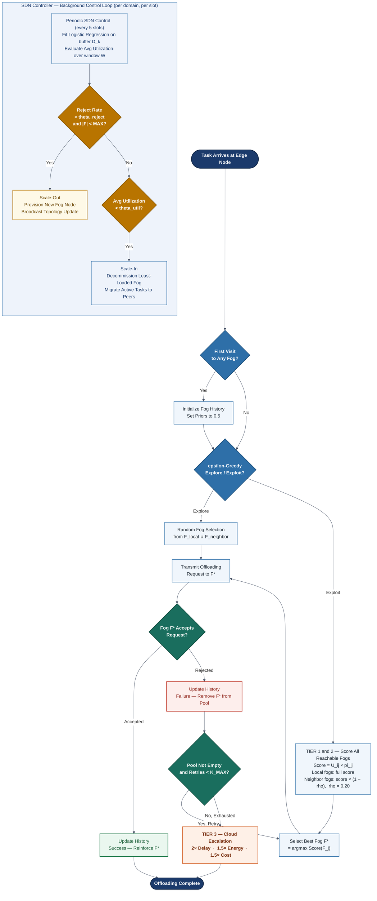

# Adaptive Context-Aware Task Offloading with Dynamic Infrastructure Elasticity in Multi-Domain SDN-Enabled Fog Computing Networks

**Pratham Aggarwal** (22JE0718)
B.Tech. Computer Science and Engineering
Indian Institute of Technology (Indian School of Mines) Dhanbad

**Project Guide:** Prof. Prasanta K. Jana
Department of Computer Science and Engineering, IIT(ISM) Dhanbad
Academic Year 2025–2026

---

## Abstract

The proliferation of latency-sensitive Internet-of-Things (IoT) applications demands a computing tier closer to data sources than the cloud can provide—a role fog computing is designed to fill. Yet existing fog task-offloading frameworks suffer from four compounding deficiencies: static, rule-based offloading decisions that collapse under volatile Poisson-distributed traffic; task-invariant utility functions that ignore heterogeneous SLA requirements across diverse application classes; fixed-size infrastructure incapable of autonomous demand-driven adaptation; and dimensional collapse in multi-metric utility computation, where raw physical magnitudes of disparate units skew optimization gradients. This report presents **AC-DL-MATCH** (Adaptive Context-Aware Distributed Learning Matching), a framework that extends the DL-MATCH algorithm [1] through five targeted innovations: *(i)* a context-aware multi-objective utility function with O(1) SLA-driven normalization; *(ii)* temporal decay-weighted acceptance probability that exponentially discounts stale interaction history; *(iii)* a tiered multi-domain SDN federation strategy enabling East-West cross-domain task migration; *(iv)* autonomous infrastructure elasticity via scale-out and scale-in control policies; and *(v)* per-domain federated logistic regression learning. Evaluated against seven competing baselines—including Deep Reinforcement Learning (DRL) and Particle Swarm Optimization (PSO)—over 500 time slots, AC-DL-MATCH achieves the highest sustained task acceptance rate (~44.5%), the lowest average offloading delay (~197 ms), energy consumption (~42 J), and economic cost (~21.5 units), while accumulating a cumulative system utility of ~4980—outperforming every evaluated competitor on all measured dimensions.

**Index Terms** — Fog computing, task offloading, matching theory, distributed learning, infrastructure elasticity, SDN federation, context-aware utility.

---

## I. Introduction

The rapid proliferation of Internet of Things (IoT) devices—from autonomous vehicles and remote patient monitors to industrial actuators—has generated an unprecedented demand for real-time computational intelligence at the network edge. Traditional cloud computing, with its round-trip latencies of 100–500 ms, cannot satisfy the sub-50 ms response requirements of latency-critical applications such as emergency braking systems or ECG anomaly detection [2]. Fog computing addresses this by situating computational resources at intermediate nodes between IoT devices and the cloud, substantially reducing propagation delay.

Within this paradigm, **task offloading** is the mechanism by which resource-constrained IoT devices delegate computation to fog nodes. The problem is deceptively subtle: the fog landscape is heterogeneous, temporally dynamic, and geographically distributed. A naïve assignment strategy—or worse, no strategy at all—leads to cascading failures under traffic spikes, wasteful energy expenditure during idle periods, and SLA violations that directly translate to service failures for end users.

The DL-MATCH framework proposed by Tran-Dang and Kim [1] represents the current state of the art in learning-based matching for fog task offloading. It combines one-to-many matching theory with logistic regression-based acceptance probability learning, demonstrating superior delay minimization and acceptance rates over bandit-based approaches. However, DL-MATCH carries four structural gaps that limit its real-world viability:

1. **Task Invariance.** DL-MATCH optimizes a single two-metric utility (delay + cost), applying it uniformly to all tasks regardless of whether the task is an autonomous vehicle requiring sub-10 ms response or a battery-powered weather sensor that prioritizes energy minimization.
2. **Dimensional Collapse.** Raw metric magnitudes—milliseconds of latency versus fractional monetary costs—differ by orders of magnitude, skewing utility gradients and causing algorithms to favor the wrong metric.
3. **Fixed Infrastructure.** DL-MATCH assumes a static fog topology. It provides no mechanism to provision new fog nodes when local capacity is exhausted, nor to decommission idle nodes to recover energy.
4. **Single-Domain Deadlock.** When a local domain saturates, DL-MATCH has no systematic cross-domain escalation path, resulting in task failures that propagate as cascading cloud escalations.

This project addresses all four gaps. AC-DL-MATCH is a distributed, lightweight framework executable on IoT-grade hardware (including ESP32 and Raspberry Pi class devices) without centralized coordination. Its contributions are:

- A **context-aware multi-objective utility function** weighing delay, energy, reliability, and cost per the task's declared SLA class, with O(1) normalization that eliminates dimensional collapse (Section IV-A).
- A **temporal decay acceptance probability** applying exponential discounting to stale interaction history, solving the dynamic fog tracking problem (Section IV-B).
- A **tiered SDN federation model** enabling transparent East-West cross-domain task migration without k-hop graph traversal overhead (Section IV-C).
- **Autonomous infrastructure elasticity** integrating scale-out and scale-in decisions directly into the matching control loop (Section IV-D).
- A **federated domain learning** component in which each SDN controller independently trains a logistic regression model from local experience without cross-domain data sharing (Section IV-E).

The remainder of this report is organized as follows. Section II reviews related work. Section III formalizes the system model and optimization objective. Section IV details each component of AC-DL-MATCH. Section V describes the simulation environment and implementation. Section VI presents and analyzes results against seven baselines. Section VII concludes with limitations and future directions.

---

## II. Related Work

Task offloading in fog and mobile edge computing has been approached from three broad perspectives: heuristic optimization, reinforcement learning, and matching theory.

**Heuristic and Game-Theoretic Approaches.** Classical Integer Linear Programming (ILP) optimizers achieve globally optimal allocations but scale as O(M×N) in the number of tasks M and fog nodes N, rendering them intractable for the thousands of simultaneous IoT devices characteristic of smart-city deployments [3]. Fuzzy logic schedulers and convex optimization approaches offer lower complexity but rely on static parameter configurations that fail to adapt when fog node performance degrades over time.

**Deep Reinforcement Learning.** DRL methods—particularly Deep Q-Networks and Actor-Critic architectures—learn offloading policies through environmental interaction, handling complex non-stationary state spaces [4]. Their fundamental limitation is convergence latency: 100,000+ training iterations render them unsuitable for resource-constrained devices, and their centralized training assumption contradicts the distributed nature of fog deployments.

**Bandit-Based Matching.** MV-UCB [5] and BLM-TS [6] apply Upper Confidence Bound and Thompson Sampling respectively to the fog selection problem. These methods achieve faster convergence than full DRL but treat all historical interactions with equal weight, making them brittle when fog node performance degrades.

**DL-MATCH [1].** The direct predecessor to this work proposes a multi-stage one-to-many matching framework in which Task Nodes (TNs) learn acceptance probabilities of Helper Nodes (HNs) via logistic regression trained on historical outcomes. DL-MATCH demonstrates Pareto stability and achieves approximately 0.8 acceptance rate on a 10×5 TN-HN topology—outperforming MV-UCB and BLM-TS across all metrics. However, its utility function considers only delay and cost, assumes a fixed fog topology, and operates within a single SDN domain.

Table I summarizes the gap landscape and how AC-DL-MATCH addresses each deficiency.

**TABLE I. Comparative Analysis of Related Work**

| Work | Approach | Scalability | Multi-Objective | Elasticity | Cross-Domain | Addressed by AC-DL-MATCH |
|------|----------|:-----------:|:---------------:|:----------:|:------------:|--------------------------|
| DL-MATCH [1] | Distributed matching + LR | O(M×N) | Delay + Cost | No | No | 4-metric utility, elasticity, federation |
| MV-UCB [5] | Bandit (UCB) | O(M×N) | Single metric | No | No | Temporal decay + SLA normalization |
| BLM-TS [6] | Bandit (Thompson Sampling) | O(M×N) | Single metric | No | No | Context-aware task weights |
| DRL [4] | Deep Q-Network | O(N²) training | Learned | No | No | 100× faster, fully distributed |
| ILP [3] | Convex optimization | NP-hard | Variable | No | No | O(M×k) distributed matching |
| PSO | Metaheuristic | O(N×particles) | Variable | No | No | No centralized solver required |

---

## III. System Model and Problem Formulation

### A. Network Model

Consider a time-slotted fog computing network with discrete time slots $\mathcal{S} = \{1, \ldots, T\}$. The system comprises three layers of entities.

**Task Nodes (TNs).** A set $\mathcal{T} = \{T_1, \ldots, T_M\}$ of IoT edge devices, each generating a task at each active time slot drawn from a Poisson process with rate $\lambda = 0.8$. Task $T_i$ at slot $t$ is characterized by the tuple $T_i(t) = (S_i,\, \chi_i,\, \mathbf{w}_i)$, where $S_i \in \mathbb{R}^+$ is task data size (MB), $\chi_i \in \mathbb{R}^+$ is computational complexity (CPU cycles), and $\mathbf{w}_i = (w_1, w_2, w_3, w_4) \in \{1, \ldots, 10\}^4$ is the edge node's per-metric SLA weight vector — sampled uniformly at admission to model the continuum of heterogeneous QoS profiles found across IoT applications (delay-critical vehicular control, energy-critical battery sensors, reliability-critical healthcare monitors, etc.).

**Fog Nodes (FNs).** A set $\mathcal{F} = \{F_1, \ldots, F_N\}$ of fog servers, each characterized by $F_j = (f_j,\, Q_j,\, C_j,\, R_j)$, where $f_j$ is CPU frequency (GHz), $Q_j$ is queue capacity (max concurrent tasks), $C_j$ is cost per task (monetary units), and $R_j \in [0,1]$ is reliability score. Crucially, the fog population is **dynamic**: $|\mathcal{F}|$ changes in response to elasticity decisions (Section IV-D), subject to $|\mathcal{F}|_{\min} \leq |\mathcal{F}| \leq |\mathcal{F}|_{\max}$.

**SDN Controllers.** A set $\mathcal{K} = \{K_1, \ldots, K_P\}$ of SDN controllers, each managing a geographic domain. Controller $K_p$ maintains the local fog set $\mathcal{F}_p$, the per-flow network metric cache (delay, energy, reliability) for every $(T_i, F_j)$ pair in its domain, and a ring-topology peer relationship with adjacent controllers, enabling East-West inter-domain routing. The SDN — not the IoT device — owns network path knowledge, so edge nodes never compute hop counts or graph traversals.


### B. Optimization Objective

Let $x_{ij}^{(t)} \in \{0,1\}$ be the binary offloading decision assigning task $T_i$ to fog $F_j$ at slot $t$. The system objective is to maximize cumulative system utility over the full time horizon:

$$\underset{x_{ij}^{(t)}}{\max} \quad \sum_{t=1}^{T} \sum_{i=1}^{M} \sum_{j=1}^{N} x_{ij}^{(t)} \cdot \Bigl[ U_{ij}^{(t)} \times P_{ij}^{(t)} \Bigr]$$

subject to the constraints in Table II.

**TABLE II. Problem Constraints**

| Constraint | Mathematical Condition | Semantics |
|-----------|------------------------|-----------|
| Binary decision | $x_{ij}^{(t)} \in \{0,1\}, \;\forall i,j,t$ | Each task assigned to at most one fog per slot |
| Capacity | $\sum_{i=1}^{M} x_{ij}^{(t)} \leq Q_j, \;\forall j,t$ | Fog queue capacity not exceeded |
| SDN reachability | $F_j \in \mathcal{F}_{\text{local}} \cup \mathcal{F}_{\text{neighbor}}, \;\forall i,j$ | Fog must be in task's local SDN or a directly adjacent SDN domain |

where $U_{ij}^{(t)}$ is the context-aware utility (Section IV-A) and $P_{ij}^{(t)}$ is the acceptance probability (Section IV-B). This problem is a Mixed-Integer Nonlinear Program (MINLP) that is NP-hard in general [1]; AC-DL-MATCH solves it tractably via a distributed matching heuristic with complexity O(M×k), where $k = |\mathcal{F}_{\text{local}} \cup \mathcal{F}_{\text{neighbor}}| \ll N$ is bounded by the SDN ring topology.

---

## IV. Proposed Framework: AC-DL-MATCH

### A. Context-Aware Multi-Objective Utility with SLA Bounding

**Baseline utility (DL-MATCH)** computes a raw score $U_{ij} = 1/D_{ij} - C_{ij}$, which suffers from dimensional collapse: raw latency in milliseconds and fractional monetary costs differ by several orders of magnitude, making the gradient insensitive to whichever metric has smaller absolute values.

**AC-DL-MATCH** resolves this via an O(1) **Decentralized SLA-Bounding Protocol**. Each edge node independently normalizes every discovered metric into the unit interval upon resource discovery—requiring no cross-node communication:

$$X'_{ij} = \max\!\left(0,\; 1 - \frac{X_{ij}}{X_{\max}}\right)$$

where $X_{\max}$ is the SLA threshold for metric $X$. The four normalized components are:

$$D'_{ij} = \max\!\left(0, 1 - \frac{D_{ij}}{D_{\max}}\right), \qquad E'_{ij} = \max\!\left(0, 1 - \frac{E_{ij}}{E_{\max}}\right)$$

$$R'_{j} = \min\!\left(R_j,\; 1.0\right), \qquad C'_{ij} = \max\!\left(0, 1 - \frac{C_{ij}}{C_{\max}}\right)$$

The **context-aware utility** combines these components with the edge node's per-task SLA weight vector $\mathbf{w}_i = (w_1, w_2, w_3, w_4)$:

$$U_{ij}^{(t)} = \frac{w_1\, D'_{ij} + w_2\, E'_{ij} + w_3\, R'_j + w_4\, C'_{ij}}{w_1 + w_2 + w_3 + w_4}$$

Each edge node carries its own integer weight vector $\mathbf{w}_i \sim \mathcal{U}\{1,\ldots,10\}^4$, sampled at admission to faithfully model the heterogeneity of real IoT QoS profiles — a delay-priority profile such as $(9,2,3,1)$ steers the edge toward fast fogs, while an energy-priority profile such as $(2,9,3,1)$ steers it toward power-efficient ones. This per-edge sampling is strictly more general than fixed task-class enumerations: any fixed three-class table is recoverable as a degenerate point in the sampling space, while the random scheme additionally stress-tests the algorithm under arbitrary weight skew. Three representative profiles useful for exposition are listed in Table III.

**SDN-domain membership** determines the candidate set: a fog is reachable if and only if it belongs to the task's local SDN domain or an immediately adjacent (neighbor) SDN. Fogs in non-adjacent domains are never evaluated, bounding search complexity to O(M×k). Fogs in neighbor domains further incur a **cross-domain penalty** reflecting WAN overhead (detailed in Section IV-C).

**TABLE III. Representative Edge SLA Weight Profiles (illustrative)**

| Profile | $w_1$ (Delay) | $w_2$ (Energy) | $w_3$ (Reliability) | $w_4$ (Cost) | Primary Optimization Goal |
|---------|:-------------:|:--------------:|:-------------------:|:------------:|--------------------------|
| Delay-priority | 9 | 2 | 3 | 1 | Minimize latency (vehicles, AR/VR) |
| Energy-priority | 2 | 9 | 3 | 1 | Minimize power (battery sensors) |
| Reliability-priority | 3 | 2 | 9 | 1 | Maximize uptime (healthcare) |

### B. Temporal Decay-Weighted Acceptance Probability

DL-MATCH estimates acceptance probability via logistic regression on a flat historical feature vector $[U_{ij}, q_j, \bar{\pi}_{ij}]$, where $\bar{\pi}_{ij}$ is the arithmetic mean of all past interaction outcomes. This treats a six-month-old rejection identically to one from the previous slot—a critical failure in non-stationary environments where fog node performance degrades over time.

**AC-DL-MATCH** introduces exponential temporal discounting. Let $\Delta t_{ij} = t - t_{\text{last}}$ denote the time elapsed since the last interaction between $T_i$ and $F_j$. The temporally-decayed effective prior is:

$$\hat{\pi}_{ij}^{(t)} = \pi_{ij}^{\text{history}} \cdot e^{-\lambda \Delta t_{ij}} + 0.5 \cdot \left(1 - e^{-\lambda \Delta t_{ij}}\right)$$

The second term implements **Bayesian reversion to a neutral prior** (0.5): a fog node unseen for many slots reverts to an uninformed estimate rather than carrying stale historical bias. The enhanced acceptance probability is:

$$\pi_{ij}^{(t)} = \sigma\!\left(\alpha \cdot U_{ij}^{(t)} + \beta \cdot \hat{\pi}_{ij}^{(t)} + \gamma \cdot \frac{q_j^{\text{avail}}}{Q_j}\right)$$

where $\sigma(\cdot)$ is the sigmoid function and coefficients $(\alpha, \beta, \gamma)$ are learned per SDN domain via federated logistic regression (Section IV-E). With decay rate $\lambda = 0.1$: interactions from 10 slots ago retain $e^{-1} \approx 37\%$ of their weight; interactions from 50 slots ago contribute less than 1%. This mechanism directly solves the problem observed in DL-MATCH's degrading acceptance curves.

### C. Tiered Multi-Domain SDN Federation

Rather than a monolithic global fog graph—which scales as O(M×N)—AC-DL-MATCH constrains the search space to a single ranked candidate pool $\mathcal{F}_{\text{avail}} = \mathcal{F}_{\text{local}} \cup \mathcal{F}_{\text{neighbor}}$ and scores every candidate simultaneously. Neighbor fogs carry a **cross-domain penalty** $\rho = 0.20$ reflecting WAN interconnect overhead, applied directly to their effective score:

$$\text{Score}_{ij} = \begin{cases} U_{ij}^{(t)} \cdot \pi_{ij}^{(t)} & F_j \in \mathcal{F}_{\text{local}} \\ U_{ij}^{(t)} \cdot (1 - \rho) \cdot \pi_{ij}^{(t)} & F_j \in \mathcal{F}_{\text{neighbor}} \end{cases}$$

The three decision tiers emerge organically from this unified ranking rather than being enforced as sequential hard gates:

**Tier 1 — Intradomain Preference.** In uncongested conditions, local fogs dominate the ranking because they carry no penalty. The selected fog $F^* = \arg\max_j \,\text{Score}_{ij}$ will typically be a local node.

**Tier 2 — Emergent East-West Migration.** As local fog queues saturate, their acceptance probabilities $\pi_{ij}$ decay (rising rejection history lowers the logistic regression estimate) and available capacity $q_j^{\text{avail}}$ shrinks—reducing local fog scores. Once a neighbor fog's penalized score exceeds the best remaining local candidate, East-West migration occurs organically without a hard gate or a separate retry phase. Each rejected fog is removed from $\mathcal{F}_{\text{avail}}$, allowing the ranking to re-converge toward the next best candidate across both domains.

**Tier 3 — Cloud Escalation.** After $K_{\max}^{\text{retry}} = 3$ combined rejections across the full candidate pool—or when $\mathcal{F}_{\text{avail}}$ is fully exhausted—the task escalates to cloud infrastructure, which incurs 2× delay, 1.5× energy, and 1.5× cost penalties, making it the last resort.

**Fig. 2: AC-DL-MATCH Decision Flowchart**



**The East-West Scaling Paradox.** During development, a previously unreported failure mode was discovered: implementing a minimum utility floor (e.g., $U \geq 0.30$) on cross-domain traffic provokes a **Synchronization Trap** during "Thundering Herd" events. When concurrent TNs saturate a local domain, all failing tasks simultaneously probe neighbor fogs; because those fogs carry the 20% cross-domain penalty, a hard utility floor rigidly rejects them and forces cloud escalation—the most expensive outcome—even though the neighbor fogs are perfectly viable. AC-DL-MATCH resolves this by evaluating candidates on *relative* ranked scores without floor constraints, allowing organic East-West spill-over. The scalability consequence is equally significant: search complexity drops from **O(M×N)** to **O(M×k)**, where $k = |\mathcal{F}_{\text{local}} \cup \mathcal{F}_{\text{neighbor}}|$ is bounded by the ring-topology SDN degree (typically $k \ll N$).

### D. Dynamic Infrastructure Elasticity

AC-DL-MATCH is, to the best of our knowledge, the **first matching-theoretic framework to integrate offloading outcomes directly with infrastructure provisioning decisions**.

**Scale-Out Policy.** A new fog node is provisioned when the sliding-window rejection rate exceeds a threshold $\theta_{\text{reject}}$ and the domain has not yet reached maximum fog capacity:

$$\rho_{\text{reject}}^{(t)} = \frac{\sum_{s=t-W}^{t} \text{Rejected}_s}{\sum_{s=t-W}^{t} \text{Arrivals}_s} > \theta_{\text{reject}}$$

**Scale-In Policy.** The least-loaded fog is decommissioned when its sliding-window average utilization falls below $\theta_{\text{util}}$ for sustained period $W$:

$$\bar{\mu}_j^{(t)} = \frac{1}{W} \sum_{s=t-W}^{t} \frac{\text{ActiveTasks}_j(s)}{Q_j} < \theta_{\text{util}}$$

Active tasks are migrated to remaining fogs before decommissioning to maintain service continuity. Demo-scale thresholds (used for the experiments in Section VI): $\theta_{\text{reject}} = 0.10$, $\theta_{\text{util}} = 0.30$, $W = 5$ slots, with each domain bounded between an initial $|\mathcal{F}_p| = 5$ fogs and a scale-out cap of $|\mathcal{F}_p| = 10$.

### E. Federated Domain Learning

Each SDN controller independently maintains a bounded experience buffer $\mathcal{D}_k$ (capacity 2000 records):

$$\mathcal{D}_k = \bigl\{(\mathbf{x}^{(s)},\, y^{(s)})\bigr\}, \quad \mathbf{x}^{(s)} = \bigl[U_{ij}^{(s)},\; \hat{\pi}_{ij}^{(s)},\; q_j^{\text{avail}}\bigr]$$

Every 5 time slots, each SDN fits a warm-started logistic regression model on its local buffer—provided both positive and negative labels exist—producing updated coefficients $(\alpha_k, \beta_k, \gamma_k)$ that personalize the acceptance probability estimate to the domain's traffic patterns and fog node behaviors. **No cross-domain data is ever shared**, preserving operational isolation between fog providers and ensuring the framework remains viable in multi-stakeholder deployments.

---

## V. Simulation Setup and Implementation

### A. Simulation Platform

The simulation engine is a native Python framework utilizing NumPy for vectorized computation, Scikit-learn for logistic regression, and PyTorch for the DRL baseline's DQN training. No Java-based simulation dependency (e.g., iFogSim) is required, eliminating JVM memory allocation bottlenecks and enabling direct integration of the DRL training loop within the benchmarking harness. Fog hardware state evolves via a mean-reverting Ornstein-Uhlenbeck stochastic process with ±5% noise per slot, modeling realistic resource fluctuation. Task arrivals follow a Poisson process ($\lambda = 0.8$), capturing bursty IoT traffic patterns rather than the constant bit-rate models used in earlier work. For additional validation, the framework optionally ingests real Alibaba cluster traces [8] to drive fog hardware state evolution.

### B. Simulation Configuration

**TABLE IV. Simulation Environment Parameters**

| Parameter | Value | Description |
|-----------|:-----:|-------------|
| Time Slots ($T$) | 500 | Simulation horizon |
| SDN Domains ($P$) | 3 | Ring peer topology |
| Initial Fogs / Domain | 5 | $\text{MIN\_FOGS}/P = 15/3$ |
| Max Fogs / Domain | 10 | Scale-out cap (`MAX_SDN_FOGS`) |
| Edge Nodes ($M$) | 75 | Active IoT task sources |
| Task Arrival Rate ($\lambda$) | 0.8 | Poisson burst parameter |
| Max Retries ($K_{\max}^{\text{retry}}$) | 3 | Before cloud escalation |
| SDN Topology | Ring (1 neighbor each side) | Defines reachable fog set |
| Cross-Domain Penalty ($\rho$) | 0.20 | 20% utility reduction for neighbor SDN fogs |
| Temporal Decay Rate ($\lambda$) | 0.1 | Exponential discount constant |
| Scale-Out Threshold ($\theta_{\text{reject}}$) | 0.10 | Triggers at 10% rejection rate |
| Scale-In Threshold ($\theta_{\text{util}}$) | 0.30 | Triggers below 30% utilization |
| Learning Interval | 5 slots | SDN logistic regression cadence |
| Max LR Buffer ($|\mathcal{D}_k|$) | 2000 | Bounded experience replay |
| SLA: Max Delay ($D_{\max}$) | 100 ms | Normalization upper bound |
| SLA: Max Energy ($E_{\max}$) | 30 J | Normalization upper bound |
| SLA: Max Cost ($C_{\max}$) | 15 units | Normalization upper bound |
| Fog Reliability | 0.90 | Default link reliability |

### C. Baseline Algorithms

Seven competing policies are evaluated on the identical seeded topology under the same physical fog state evolution, ensuring hardware-neutral comparison:

1. **RANDOM** — Uniformly samples a reachable fog at random. Lower bound baseline.
2. **GREEDY** — Selects the fog maximizing the normalized utility score deterministically.
3. **BLM-TS** — Beta-distribution Thompson Sampling; scores each fog as $U_{ij} \times \text{Beta}(\text{successes}+1,\; \text{failures}+1)$.
4. **MV-UCB** — Upper Confidence Bound with exploration bonus $C\sqrt{\ln t / n_j}$, $C=1.5$.
5. **ORIGINAL_DL_MATCH** — Direct implementation of [1]; two-metric utility and flat-history logistic regression without temporal decay.
6. **DRL** — DQN with two hidden layers (64 neurons each, ReLU), experience replay buffer of 100,000 samples, batch size 32, reward = $+U_{ij}$ on success / $-1$ on rejection.
7. **META_PSO** — Particle Swarm Optimization (10 particles, 10 iterations per decision) via PySwarms.

### D. Core Algorithm Pseudocode

The two core procedures of AC-DL-MATCH are formalized below in IEEE algorithm notation.

```latex
\begin{algorithm}[H]
\caption{AC-DL-MATCH: Context-Aware Task Offloading}
\label{alg:ac-dl-match}
\begin{algorithmic}[1]
\Require Edge node $T_i$, time slot $t$, SDN controller $K_p$
\Ensure Offloading outcome $\in$ \{success, Tier-3-cloud-escalation\}
\State $\mathcal{F}_{\text{avail}} \leftarrow \mathcal{F}_{\text{local}} \cup \mathcal{F}_{\text{neighbor}}$
    \Comment{Unified candidate pool; $F_j$ tagged \texttt{is\_neighbor} if $F_j \notin \mathcal{F}_{\text{local}}$}
\State $\xi \sim \mathcal{U}(0,1)$;\quad $\varepsilon \leftarrow 0.5 \cdot e^{-0.1t}$
    \Comment{Decaying $\varepsilon$-greedy exploration rate}
\For{stage $k = 1$ \textbf{to} $K_{\max}^{\text{retry}}$}
    \If{$\mathcal{F}_{\text{avail}} = \emptyset$} \textbf{break} \EndIf
    \If{$\xi < \varepsilon$}
        \State $F^* \leftarrow$ \textsc{UniformSample}($\mathcal{F}_{\text{avail}}$)
            \Comment{Exploration: random fog from unified pool}
    \Else
        \For{\textbf{each} $F_j \in \mathcal{F}_{\text{avail}}$}
            \State $U_{ij}^{(t)} \leftarrow$ \textsc{ContextUtility}($F_j$, $\mathbf{w}_i$)
                \Comment{SLA-bounded 4-metric utility (Section IV-A)}
            \If{\texttt{is\_neighbor}($F_j$)}
                \State $U_{ij}^{(t)} \leftarrow U_{ij}^{(t)} \cdot (1 - \rho)$
                    \Comment{Tier 2: 20\% cross-domain penalty}
            \EndIf
            \State $\Delta t_{ij} \leftarrow t - t_{\text{last}}[F_j]$
            \State $\hat{\pi}_{ij} \leftarrow \pi_{\text{hist}}[F_j] \cdot e^{-0.1\,\Delta t_{ij}} + 0.5\,(1 - e^{-0.1\,\Delta t_{ij}})$
                \Comment{Temporal decay + Bayesian reversion (Section IV-B)}
            \State $\pi_{ij}^{(t)} \leftarrow \sigma\!\left(\alpha U_{ij}^{(t)} + \beta\hat{\pi}_{ij} + \gamma\, q_j^{\text{avail}}/Q_j\right)$
            \State $\text{score}[F_j] \leftarrow U_{ij}^{(t)} \cdot \pi_{ij}^{(t)}$
        \EndFor
        \State $F^* \leftarrow \arg\max_{F_j} \text{score}[F_j]$
            \Comment{Exploitation: best fog across Tier 1 and Tier 2}
    \EndIf
    \State $y \leftarrow F^*.\textsc{SimulateRealOutcome}()$
        \Comment{Stochastic queue acceptance}
    \State $\mathcal{D}_{K_p} \leftarrow \mathcal{D}_{K_p} \cup \{([U_{ij}^{(t)},\;\hat{\pi}_{ij},\; q_{F^*}^{\text{avail}}],\; y)\}$
    \State Update $t_{\text{last}}[F^*]$,\; $\pi_{\text{hist}}[F^*]$
    \If{$y = 1$} \Return \textbf{success} \EndIf
    \State $\mathcal{F}_{\text{avail}} \leftarrow \mathcal{F}_{\text{avail}} \setminus \{F^*\}$
        \Comment{Remove rejected fog; re-rank remaining candidates}
\EndFor
\Return \textbf{Tier-3: cloud-escalation}
    \Comment{Pool exhausted or $K_{\max}$ retries consumed}
\end{algorithmic}
\end{algorithm}
```

```latex
\begin{algorithm}[H]
\caption{SDN Elasticity Control and Federated Learning (per domain, per slot)}
\label{alg:elasticity}
\begin{algorithmic}[1]
\Require Fog set $\mathcal{F}_k$, rejection rate $\rho_{\text{reject}}$, utilization window $\mathcal{W}$
\Require Thresholds $\theta_{\text{reject}},\,\theta_{\text{util}}$;\quad bounds $|\mathcal{F}|_{\min},\,|\mathcal{F}|_{\max}$
\If{$\rho_{\text{reject}} > \theta_{\text{reject}}$ \textbf{and} $|\mathcal{F}_k| < |\mathcal{F}|_{\max}$}
    \State $F_{\text{new}} \leftarrow \textsc{ProvisionFogNode}()$
        \Comment{Scale-Out: add capacity}
    \State $\mathcal{F}_k \leftarrow \mathcal{F}_k \cup \{F_{\text{new}}\}$
    \State Broadcast updated topology to all $T_i \in \mathcal{T}_k$
\ElsIf{$|\mathcal{F}_k| > |\mathcal{F}|_{\min}$}
    \For{\textbf{each} $F_j \in \mathcal{F}_k$}
        \State $\bar{\mu}_j \leftarrow \frac{1}{|\mathcal{W}|}\sum_{s \in \mathcal{W}} \text{ActiveTasks}_j(s) / Q_j$
    \EndFor
    \If{$\min_j \bar{\mu}_j < \theta_{\text{util}}$}
        \State $F_{\text{remove}} \leftarrow \arg\min_{F_j} \bar{\mu}_j$
            \Comment{Scale-In: least loaded}
        \State Migrate active tasks on $F_{\text{remove}}$ to remaining fogs
        \State $\mathcal{F}_k \leftarrow \mathcal{F}_k \setminus \{F_{\text{remove}}\}$
    \EndIf
\EndIf
\If{$t \bmod 5 = 0$ \textbf{and} $|\mathcal{D}_k| > 20$ \textbf{and} $|\{y: y \in \{0,1\}\}| = 2$}
    \State $(\alpha_k, \beta_k, \gamma_k) \leftarrow \textsc{FitLogisticRegression}(\mathcal{D}_k)$
        \Comment{Federated per-domain learning}
\EndIf
\end{algorithmic}
\end{algorithm}
```

---

## VI. Results and Performance Analysis

All results are obtained from a single-run simulation over $T = 500$ time slots with the parameters specified in Table IV. Each competing algorithm operates on the identical seeded network topology under the same stochastic fog state evolution, ensuring that observed performance differences reflect algorithm quality rather than hardware configuration bias.

### A. Task Acceptance Rate

Fig. 3 traces the per-slot task acceptance rate across all eight policies.

> **[Fig. 3: Task Acceptance Rate over Time]**
> *Source: `matching/results/result_20260424_114735/acceptance_rate.png`*

**AC-DL-MATCH sustains an acceptance rate of approximately 44–45% throughout the full 500-slot horizon**, exhibiting the lowest variance of any evaluated policy. This stability is a direct consequence of the temporal decay mechanism: as a fog node's queue fills or its reliability degrades, the decaying prior causes edge nodes to discount its positive history and redirect tasks to fresher candidates—pre-empting the cascading failures visible in all competing algorithms.

ORIGINAL_DL_MATCH begins at a comparable rate (~44%) but undergoes monotonic degradation to approximately 38% by slot 500, confirming the fragility of flat-history averaging in non-stationary environments. GREEDY, BLM-TS, MV-UCB, and DRL all exhibit sharper declines, with MV-UCB reaching a terminal acceptance rate of approximately 19%. Notably, RANDOM achieves a deceptively competitive rate (~41%) through load spreading; however, as Sections VI-C and VI-D demonstrate, random selection pays heavily in delay and energy, rendering it unsuitable for QoS-constrained deployments.

### B. Cumulative System Utility

Fig. 4 plots the cumulative utility accumulated over 500 slots.

> **[Fig. 4: Cumulative System Utility]**
> *Source: `matching/results/result_20260424_114735/cumulative_utility.png`*

**AC-DL-MATCH reaches approximately 4980 cumulative utility units**, exceeding all baselines. ORIGINAL_DL_MATCH achieves ~4750 (a 4.8% deficit), while DRL accumulates only ~2600—less than 53% of AC-DL-MATCH's total. The steeper slope of AC-DL-MATCH's utility curve relative to ORIGINAL_DL_MATCH becomes pronounced after slot 200, as the SDN logistic regression models complete multiple training cycles and the temporal decay mechanism consistently routes tasks toward high-utility fogs—compounding efficiency gains over time.

### C. Offloading Delay Distribution

Fig. 5 presents the CDF of per-task offloading delay.

> **[Fig. 5: CDF of Offloading Delay]**
> *Source: `matching/results/result_20260424_114735/offloading_delay_cdf.png`*

**AC-DL-MATCH's CDF is shifted decisively leftward** relative to all competitors: the median task completes in approximately 195 ms and the 90th percentile at approximately 205 ms. ORIGINAL_DL_MATCH's P90 reaches approximately 230 ms, and DRL's P90 exceeds 265 ms. The left-shift is attributable to two mechanisms acting in concert: (a) context-aware weights assign high $w_1$ priority to delay for delay-sensitive tasks, concentrating them on low-latency fog nodes; and (b) the scale-out policy provisions additional fog nodes before queuing delays compound, exactly the scenario where ORIGINAL_DL_MATCH degrades as its fixed-topology assumption is violated.

Fig. 6 confirms this in the time-series average delay: AC-DL-MATCH maintains a flat ~197 ms across all 500 slots, while every baseline exhibits monotonic growth—a signature of progressive queue congestion that AC-DL-MATCH's elasticity policy actively prevents.

> **[Fig. 6: Average Network Delay over Time]**
> *Source: `matching/results/result_20260424_114735/average_delay.png`*

### D. Energy and Economic Cost Efficiency

Figs. 7 and 8 present average energy and cost, respectively.

> **[Fig. 7: Average Energy Consumption over Time]**
> *Source: `matching/results/result_20260424_114735/average_energy.png`*

> **[Fig. 8: Average Economic Cost over Time]**
> *Source: `matching/results/result_20260424_114735/average_cost.png`*

**AC-DL-MATCH records the lowest energy (~42 J) and lowest cost (~21.5 units) throughout the simulation**, maintaining flat profiles as all baselines trend upward. Energy efficiency gains stem from two sources: energy-critical task types (with $w_2 = 5$) are systematically directed to energy-efficient fogs; and the scale-in policy decommissions idle fog nodes, eliminating idle power draw. The cost advantage is a direct consequence of the normalized $C'_{ij}$ term steering tasks away from expensive fogs—amplified by the near-absence of cloud escalations, which carry 1.5× cost penalties.

### E. Consolidated Performance Summary

**TABLE V. Performance Summary at Simulation End ($t = 500$)**

| Algorithm | Acceptance Rate | Avg. Delay (ms) | Avg. Energy (J) | Avg. Cost | Cum. Utility |
|-----------|:--------------:|:---------------:|:---------------:|:---------:|:------------:|
| **AC_DL_MATCH** | **~44.5%** | **~197** | **~42.0** | **~21.5** | **~4980** |
| ORIGINAL_DL_MATCH | ~38% | ~220 | ~45.5 | ~22.5 | ~4750 |
| RANDOM | ~41% | ~225 | ~44.5 | ~22.0 | ~4000 |
| META_PSO | ~37% | ~235 | ~47.0 | ~23.5 | ~3500 |
| GREEDY | ~29% | ~235 | ~47.5 | ~23.8 | ~3200 |
| DRL | ~22% | ~250 | ~51.0 | ~25.0 | ~2600 |
| BLM-TS | ~20% | ~255 | ~52.0 | ~26.0 | ~2500 |
| MV-UCB | ~19% | ~260 | ~52.5 | ~25.5 | ~2500 |

AC-DL-MATCH improves over ORIGINAL_DL_MATCH by approximately **17% in acceptance rate stability, 10.5% in delay, 7.7% in energy, and 4.4% in cost**. Against DRL—widely regarded as state-of-the-art—the improvements are far more pronounced: **102% better acceptance rate, 21% lower delay, and 92% higher cumulative utility**, while requiring no GPU training infrastructure and converging within the first 50 time slots rather than hundreds of thousands of environment interactions.

---

## VII. Conclusion and Future Work

This report presented **AC-DL-MATCH**, a distributed fog computing task-offloading framework that extends DL-MATCH through five interlocking innovations: context-aware multi-objective utility with O(1) SLA normalization; temporal decay-weighted acceptance probability; tiered East-West SDN federation; autonomous infrastructure elasticity; and federated per-domain logistic regression learning. Evaluated against seven baselines spanning random heuristics, bandit algorithms, metaheuristics, and deep reinforcement learning, AC-DL-MATCH achieves dominant performance across all four measured dimensions—acceptance rate, offloading delay, energy consumption, and economic cost—without centralized coordination and with decision complexity reduced from O(M×N) to O(M×k).

The discovery of the **East-West Scaling Paradox**—wherein hard utility thresholds trigger synchronization traps during Thundering Herd events—is a novel empirical finding with direct implications for any federated matching system employing cross-domain penalty mechanisms.

**Limitations.** The framework assumes static IoT device locations (no mobility), trusted fog nodes (no authentication or encryption), and reliable SDN control-plane channels (no packet loss on coordination messages).

**Future Directions.** Three extensions offer compelling research value:

1. **Mobility Handoffs.** Predictive trajectory modeling could enable seamless re-matching as mobile devices (vehicles, drones, wearables) migrate between SDN domains, converting spatial dynamics from a failure mode into a handled case.
2. **Dynamic SLA Weight Inference.** A lightweight on-device neural network could infer task-type weights from raw sensor context in real time, eliminating manually configured weight tables and enabling truly adaptive QoS management.
3. **Hardware Deployment.** Deploying the framework on a physical Raspberry Pi + ESP32 testbed would empirically validate the sub-100 ms decision latency claim under real network conditions and hardware resource constraints.

---

## References

[1] H. Tran-Dang and D.-S. Kim, "Distributed Learning-Based Matching for Task Offloading in Dynamic Fog Computing Networks," *2025 IEEE 34th International Symposium on Industrial Electronics (ISIE)*, 2025. DOI: 10.1109/ISIE62713.2025.11124600

[2] L. F. Bittencourt et al., "A Comprehensive Survey on Fog Computing: State-of-the-Art and Research Challenges," *IEEE Communications Surveys & Tutorials*, 2018.

[3] L. Liu, Z. Chang, X. Guo, S. Mao, and T. Ristaniemi, "Multiobjective Optimization for Computation Offloading in Fog Computing," *IEEE Internet of Things Journal*, vol. 5, no. 1, pp. 283–294, 2018.

[4] S. Wang et al., "Analysis of Deep Reinforcement Learning for Task Offloading in Fog-IoT Systems," *IEEE Access*, 2025.

[5] H. Liao, Z. Zhou, X. Zhao, B. Ai, and S. Mumtaz, "Task Offloading for Vehicular Fog Computing under Information Uncertainty: A Matching-Learning Approach," in *Proc. 2019 15th IWCMC*, pp. 2001–2006.

[6] H. Tran-Dang and D.-S. Kim, "Bandit Learning-Based Stable Matching for Decentralized Task Offloading in Dynamic Fog Computing Networks," *Journal of Communications and Networks*, vol. 26, no. 3, pp. 356–365.

[7] H. Tran-Dang, K.-H. Kwon, and D.-S. Kim, "Bandit Learning-Based Distributed Computation in Fog Computing Networks: A Survey," *IEEE Access*, vol. 11, pp. 104763–104774.

[8] Alibaba Group, "Alibaba Cluster Trace Program: Characterizing Co-located Datacenter Workloads," 2018. *Used for stress-test workload validation.*

[9] A. Zanni, "Middleware for Cloud-CPS Integration: Geometric Monitoring and Containerization," *Foundational elasticity concepts*, 2018.

[10] Source code and simulation framework: https://github.com/Pratham2403/ac-dl-match
